Stone et al. 2023 methylation analysis
================
Carl Stone, Gwyneth Boyer, & Megan Behringer

# CoMMA: Comparison of Microbial Methylated Adenines

Below is the code for replicating all analyses in Stone et al. 2023. The
functions sourced in block 3 can also be found in this repository. CoMMA
can be found at <https://github.com/carl-stone/CoMMA>. More details on
general nanopore methylation analysis in bacteria can be found in the
CoMMA repository.

## Raw data and pre-processing

``` r
library(tidyverse)
library(methylKit)
library(cowplot)
library(ggrepel)
library(vegan)
library(ggfortify)
library(moments)
library(RColorBrewer)
library(R.utils)
library(boot)
library(preprocessCore)
library(rstatix)
library(modelr)
library(splines)
library(MASS)
library(ggpubr)
library(circlize)
library(eulerr)
library(ragg)
library(Metrics)
library(quantreg)
library(remotes)
library(gtools)
library(readxl)
library(circlize)
library(ggupset)
library(pairwiseAdonis)
library(enrichplot)
library(DOSE)
library(clusterProfiler)
library(org.EcK12.eg.db)

if (!require("ggview")) {
  remotes::install_github("idmn/ggview")
  library(ggview)
}
```

``` r
# Set wd to Behringer_Lab_Box_Drive
if (Sys.info()['nodename'] == "AS707CQ6X2" |
    Sys.info()['nodename'] == "carls-mbp.lan" |
    Sys.info()['nodename'] == "Carls-MacBook-Pro.local") {
  setwd("/Users/carlstone/Library/CloudStorage/Box-Box/Behringer_Lab_Box_Drive")
} else if (Sys.info()['nodename'] == "DESKTOP-QM8UFU1") {
  setwd("C:/Users/carls/Box/Behringer_Lab_Box_Drive")
} else {
  print('Cannot set path on this device, do it yourself.')
}
source('Projects/LongTermExpEvo/MethylationProject/Rscripts/functions.R')

allCallers_WT <-  read.table(file = "Projects/LongTermExpEvo/MethylationProject/Benchmarking/WT_All_Callers_m6A.txt",
                             sep = "\t", 
                             header = TRUE)

euler_data <- read_excel(path = 'Projects/LongTermExpEvo/MethylationProject/Benchmarking/WT_allCallers_annotated.xlsx')

mgAllSamples <- as_tibble(read.table(file = 'Projects/LongTermExpEvo/MethylationProject/ComparativeAnalysis/RawDataFiles/SortedFiles/MethylPercent_Coverage_All_NoBlank.txt',
                                     sep = '\t',
                                     header = T))

genome_sites <- read_tsv(file = 'Projects/LongTermExpEvo/MethylationProject/Ecoli_Annotation/all_site_annotations.txt')
```

    ## Rows: 29972 Columns: 6
    ## ── Column specification ────────────────────────────────────────────────────────
    ## Delimiter: "\t"
    ## chr (4): Site, Type, Strand, Transcription-Units
    ## dbl (2): Left, Right
    ## 
    ## ℹ Use `spec()` to retrieve the full column specification for this data.
    ## ℹ Specify the column types or set `show_col_types = FALSE` to quiet this message.

``` r
siteMutations <- read_tsv(file = '/Users/carlstone/Library/CloudStorage/Box-Box/Behringer_Lab_Box_Drive/Projects/LongTermExpEvo/MethylationProject/GATC_Mutation_Data/SummaryData/GATCsiteSummary.txt')
```

    ## Rows: 50 Columns: 8
    ## ── Column specification ────────────────────────────────────────────────────────
    ## Delimiter: "\t"
    ## chr (7): gain/loss, gene, ref, alt, sample, genotype, questionable
    ## dbl (1): position
    ## 
    ## ℹ Use `spec()` to retrieve the full column specification for this data.
    ## ℹ Specify the column types or set `show_col_types = FALSE` to quiet this message.

``` r
allCallers_WT <- allCallers_WT %>% 
  dplyr::select(c(DS_Position, DS_Strand_WT1, 
                  contains("Coverage"), contains("Methyl"))) %>% 
  dplyr::select(!contains("Var")) %>% 
  dplyr::rename(
    Position = DS_Position,
    Strand = DS_Strand_WT1,
  ) %>% 
  dplyr::rename_with(~ gsub("Methyl_Percent", "MethylPercent", .x)) %>% 
  drop_na()

allCallers_WT <- allCallers_WT %>% 
  filter(DS_Coverage_WT1 > 10 &
         DS_Coverage_WT2 > 10 &
         DS_Coverage_WT3 > 10) %>% 
  filter(mC_Coverage_WT1 > 10 &
         mC_Coverage_WT2 > 10 &
         mC_Coverage_WT3 > 10) %>% 
  filter(Mg_Coverage_WT1 > 10 &
         Mg_Coverage_WT2 > 10 &
         Mg_Coverage_WT3 > 10) %>% 
  filter(Tm_Coverage_WT1 > 10 &
         Tm_Coverage_WT2 > 10 &
         Tm_Coverage_WT3 > 10)

# Add mean methylation for each site
allCallers_WT$DS_MethylPercent_Mean <- rowMeans(cbind(allCallers_WT$DS_MethylPercent_WT1,
                                                      allCallers_WT$DS_MethylPercent_WT2,
                                                      allCallers_WT$DS_MethylPercent_WT3))
allCallers_WT$mC_MethylPercent_Mean <- rowMeans(cbind(allCallers_WT$mC_MethylPercent_WT1,
                                                      allCallers_WT$mC_MethylPercent_WT2,
                                                      allCallers_WT$mC_MethylPercent_WT3))
allCallers_WT$Mg_MethylPercent_Mean <- rowMeans(cbind(allCallers_WT$Mg_MethylPercent_WT1,
                                                      allCallers_WT$Mg_MethylPercent_WT2,
                                                      allCallers_WT$Mg_MethylPercent_WT3))
allCallers_WT$Tm_MethylPercent_Mean <- rowMeans(cbind(allCallers_WT$Tm_MethylPercent_WT1,
                                                      allCallers_WT$Tm_MethylPercent_WT2,
                                                      allCallers_WT$Tm_MethylPercent_WT3))

allCallers_WT_long <- allCallers_WT %>% 
  pivot_longer(
    cols = DS_Coverage_WT1:Tm_MethylPercent_WT3,
    names_to = c("Method", ".value", "Sample"),
    names_sep = "_"
  ) 

allCallers_WT_average_long <- allCallers_WT %>% 
  dplyr::select(c(Position, Strand, contains("Mean"))) %>% 
  pivot_longer(
    cols = contains("Mean"),
    names_to = c("Method", ".value", "Sample"),
    names_sep = "_"
  ) 

mgAllSamples <- mgAllSamples %>%
  dplyr::mutate(across(c(cov_WT1:methyl_129.3), as.numeric))
mgAllSamples$Position <- mgAllSamples$Position + 1
mgAllSamplesLong <- mgAllSamples %>%
  pivot_longer(
    cols = cov_WT1:methyl_129.3,
    names_to = c(".value", "sample"),
    names_sep = "_"
  ) %>%
  filter(cov >= 10) %>% 
  drop_na()
mgAllSamples <- mgAllSamplesLong %>% 
  pivot_wider(names_from = sample,
              values_from = c(cov, methyl)) %>% 
  drop_na()
mgAllSamplesLong$genotype <- mgAllSamplesLong$sample
mgAllSamplesLong <- mgAllSamplesLong %>% 
  mutate(genotype = dplyr::recode(
    genotype,
    WT1 = 'anc',
    WT2 = 'anc',
    WT3 = 'anc',
    '125.6' = 'WT',
    '125.7' = 'WT',
    '129.1' = 'WT',
    '129.3' = 'WT',
    '113.1' = 'MMR',
    '113.2' = 'MMR',
    '126.2' = 'MMR',
    '126.4' = 'MMR'
  ))

mgAllSamplesLong <- mgAllSamplesLong %>% 
  dplyr::rename(beta = "methyl")

# Set alpha to 1 over the largest coverage value 
mgAllSamplesLong$m <- methylBtoM(mgAllSamplesLong$beta, alpha = 0.01)

mgAllSamplesLong$genotype <- mgAllSamplesLong$sample
mgAllSamplesLong <- mgAllSamplesLong %>% 
  mutate(genotype = dplyr::recode(
    genotype,
    WT1 = 'anc',
    WT2 = 'anc',
    WT3 = 'anc',
    '125.6' = 'WT',
    '125.7' = 'WT',
    '129.1' = 'WT',
    '129.3' = 'WT',
    '113.1' = 'MMR',
    '113.2' = 'MMR',
    '126.2' = 'MMR',
    '126.4' = 'MMR'
  ))

WT_average <- mgAllSamplesLong %>% 
  filter(sample == 'WT1' |
           sample == 'WT2' |
           sample == 'WT3') %>% 
  group_by(Position) %>% 
  dplyr::summarize(cov = mean(cov),
            beta = mean(beta),
            m = mean(m))
WT_average <- left_join(WT_average,
                        allCallers_WT[, 1:2],
                        by = "Position")
WT_average <- WT_average %>%
  mutate(Strand = str_replace(Strand, "Plus", "+")) %>% 
  mutate(Strand = str_replace(Strand, "Minus", "-"))
```

## Methylation caller benchmarking

``` r
methyl_distribution_by_caller <- allCallers_WT_average_long %>%
  ggplot(aes(x = MethylPercent*100, fill = Method)) +
  geom_density(alpha = 0.85) +
  scale_fill_brewer(palette = "Pastel1") +
  scale_y_continuous(expand = expansion(mult = c(0, 0.05))) +
  scale_x_continuous(expand = expansion(mult = c(0,0))) +
  coord_cartesian(xlim = c(70, 100)) +
  theme_stone() +
  theme(legend.position = c(0.25, 0.7),
        legend.box.background = element_rect(color = "black",
                                             linewidth = 1)) +
  labs(x = "Percent methylated reads",
       y = "Density",
       fill = paste0("Methylation\ncaller"))

methyl_distribution_by_caller
```

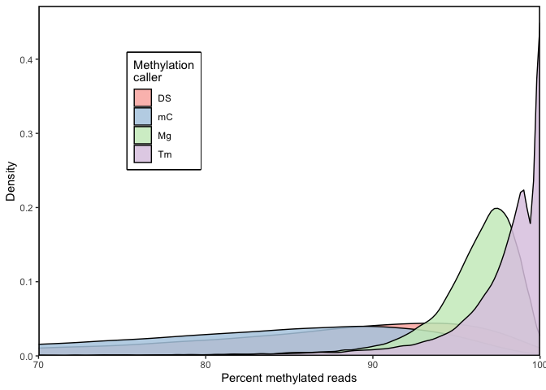<!-- -->

``` r
# Euler diagram showing overlap between replicates of each caller ---------
# and between consistent sites of all four callers


euler_data <- euler_data %>% 
  dplyr::select(Position, DS_60_1:Tm_count)

pos <- euler_data$Position

# Can flip around A and B to find intersect of methylated sites (1 = A) or 
# intersect of unmethylated sites (1 = B)
DS_sites <- euler_data %>% 
  dplyr::select(DS_60_1:DS_60_3) %>% 
  mutate(across(everything(), ~replace(., . == 1, 'A'))) %>% 
  mutate(across(everything(), ~replace(., . == 0, 'B')))
DS_sites <- as.matrix(DS_sites)
rownames(DS_sites) <- pos
colnames(DS_sites) <- c('Rep 1','Rep 2','Rep 3')
mC_sites <- euler_data %>% 
  dplyr::select(mC_60_1:mC_60_3) %>% 
  mutate(across(everything(), ~replace(., . == 1, 'A'))) %>% 
  mutate(across(everything(), ~replace(., . == 0, 'B')))
mC_sites <- as.matrix(mC_sites)
rownames(mC_sites) <- pos
colnames(mC_sites) <- c('Rep 1','Rep 2','Rep 3')
Mg_sites <- euler_data %>% 
  dplyr::select(Mg_60_1:Mg_60_3) %>% 
  mutate(across(everything(), ~replace(., . == 1, 'A'))) %>% 
  mutate(across(everything(), ~replace(., . == 0, 'B')))
Mg_sites <- as.matrix(Mg_sites)
rownames(Mg_sites) <- pos
colnames(Mg_sites) <- c('Rep 1','Rep 2','Rep 3')
Tm_sites <- euler_data %>% 
  dplyr::select(Tm_60_1:Tm_60_3) %>% 
  mutate(across(everything(), ~replace(., . == 1, 'A'))) %>% 
  mutate(across(everything(), ~replace(., . == 0, 'B')))
Tm_sites <- as.matrix(Tm_sites)
rownames(Tm_sites) <- pos
colnames(Tm_sites) <- c('Rep 1','Rep 2','Rep 3')

DS_euler <- euler(DS_sites, shape = 'ellipse')
mC_euler <- euler(mC_sites, shape = 'ellipse')
Mg_euler <- euler(Mg_sites, shape = 'ellipse')
Tm_euler <- euler(Tm_sites, shape = 'ellipse')
DS_reps_euler_plot <- plot(DS_euler, quantities = TRUE)
mC_reps_euler_plot <- plot(mC_euler, quantities = TRUE)
Mg_reps_euler_plot <- plot(Mg_euler, quantities = TRUE)
Tm_reps_euler_plot <- plot(Tm_euler, quantities = TRUE)
all_callers_all_replicates_grid <- plot_grid(DS_reps_euler_plot,
                                             mC_reps_euler_plot,
                                             Mg_reps_euler_plot,
                                             Tm_reps_euler_plot,
                                             labels = c("DeepSignal",
                                                        "mCaller",
                                                        "Megalodon",
                                                        "Tombo"))

DS_under <- euler_data %>% 
  filter(DS_count == 0) %>% 
  dplyr::select(Position)
mC_under <- euler_data %>% 
  filter(mC_count == 0) %>% 
  dplyr::select(Position)
Mg_under <- euler_data %>% 
  filter(Mg_count == 0) %>% 
  dplyr::select(Position)
Tm_under <- euler_data %>% 
  filter(Tm_count == 0) %>% 
  dplyr::select(Position)

# make a list of all consistently undermethylated sites for each caller
all_undermethylated_sites <- list(DeepSignal = DS_under$Position,
                                  mCaller = mC_under$Position,
                                  Megalodon = Mg_under$Position,
                                  Tombo = Tm_under$Position)

all_callers_euler <- euler(all_undermethylated_sites, shape = 'ellipse')
all_callers_euler_plot <- plot(all_callers_euler,
                               quantities = TRUE,
                               fills = brewer.pal(4, "Pastel1"),
                               adjust_labels = TRUE)
```

    ## Warning in plot.euler(all_callers_euler, quantities = TRUE, fills =
    ## brewer.pal(4, : `adjust_labels` is deprecated and no longer has any effect.

``` r
#ggsave(filename = paste0('euler_undermethylated_sites_', Sys.Date(), ".png") ,
#       plot = all_callers_euler_plot,
#       path = 'Projects/LongTermExpEvo/MethylationProject/Manuscript/Figures',
#       device = agg_png,
#       width = 8,
#       height = 6.5
#)
```

``` r
# Inconsistently called sites bar graph
n_inconsistent_sites <- tibble(Caller = c("DeepSignal","mCaller","Megalodon","Tombo"),
                               nSites = c(2340, 3577, 162, 294))
n_sites_total <- 38236
n_inconsistent_sites$psites <- c(2340/n_sites_total*100, 3577/n_sites_total*100, 162/n_sites_total*100, 294/n_sites_total*100)
n_inconsistent_sites$Caller <- forcats::as_factor(n_inconsistent_sites$Caller)

plot_inconsistent_sites <- ggplot(n_inconsistent_sites, aes(x = Caller,
                                                            y = psites, 
                                                            fill = Caller)) +
  geom_bar(stat = "identity", color = 'black') +
  scale_fill_brewer(palette = "Pastel1") +
  scale_y_continuous(limits = c(0,10),
                     expand = expansion(mult = c(0,0.05)),
                     breaks = seq(0,10, 2),
                     minor_breaks = seq(1:10)) +
  theme_stone() +
  theme(legend.position = 'none') +
  labs(x = 'Methylation caller program',
       y = "Percent sites inconsistently classified")

plot_inconsistent_sites
```

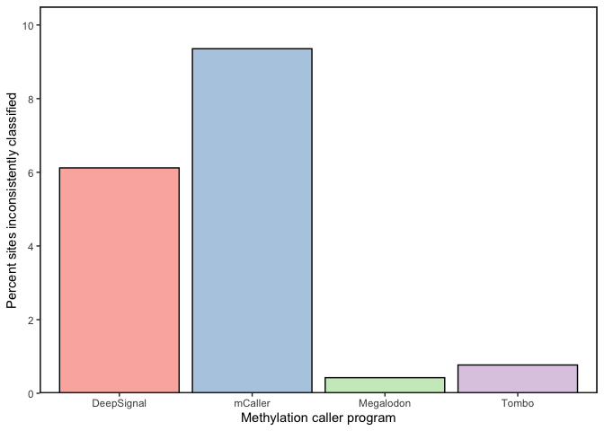<!-- -->

``` r
known_nonmethylated_sites <- tibble(Strand = c('+','-','+','-'),
                                    Locus = c('srlR','srlR','mtlA','mtlA'),
                                    DeepSignal = c(0.35, 0.70, 0.30, 0.62),
                                    mCaller = c(0.16, 0.18, 0.44, 0.24),
                                    Megalodon = c(0.37, 0.15, 0.25, 0.47),
                                    Tombo = c(0.12, 0.38, 0.80, 0.31)) %>% 
  pivot_longer(cols = DeepSignal:Tombo,
               names_to = 'Caller',
               values_to = 'pMethylated')

plot_known_nonmethylated_sites <- ggplot(known_nonmethylated_sites,
                                         aes(x = Strand, y = pMethylated*100, fill = Caller)) +
  geom_bar(stat = 'identity', position = position_dodge(), color = 'black') +
  facet_wrap(~Locus) +
  geom_hline(yintercept = 60, color = 'red') +
  scale_fill_brewer(palette = "Pastel1") +
  scale_y_continuous(expand = expansion(mult = c(0, 0.05))) +
  theme_stone() +
  theme(axis.text.x = element_text(size = 14),
        legend.position = "none",
        strip.text.x = element_text(face = "bold",
                                    size = 12),
        strip.background = element_rect(fill = "white")) +
  labs(y = 'Percent methylated reads')

plot_known_nonmethylated_sites
```

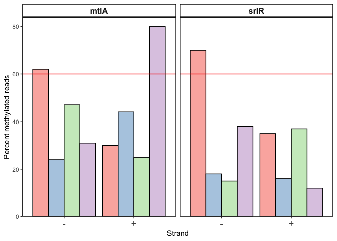<!-- -->

``` r
figure_2 <- plot_grid(methyl_distribution_by_caller,
                      all_callers_euler_plot,
                      plot_inconsistent_sites,
                      plot_known_nonmethylated_sites,
                      labels = c("A", "B", "C", "D"))

ggview(figure_2, height = 7, width = 8)

#ggsave(figure_2,
#       filename = "/Users/carlstone/Library/CloudStorage/Box-Box/Behringer_Lab_Box_Drive/Projects/LongTermExpEvo/MethylationProject/Manuscript/Figures/figure_2.pdf",
#       width = 8,
#       height = 7)

#ggsave(figure_2,
#       filename = "/Users/carlstone/Library/CloudStorage/Box-Box/Behringer_Lab_Box_Drive/Projects/LongTermExpEvo/MethylationProject/Manuscript/Figures/figure_2.png",
#       width = 8,
#       height = 7,
#       dpi = 320)
```

## WT methylome characterization

``` r
WT_average_annotated <- annotateMethylSites(methyl_df = WT_average,
                                             meta_df = genome_sites,
                                             location = 'Position')
WT_average_annotated_long <-  WT_average_annotated %>% 
  dplyr::select(!'Transcription-Units') %>% 
  pivot_longer(cols = Genes:'Origin-of-Replication',
               names_to = 'feature_type',
               values_to = 'feature_name') %>% 
  drop_na()
```

``` r
WT_dist <- mgAllSamplesLong %>% 
  filter(sample == 'WT1' |
           sample == 'WT2' |
           sample == 'WT3') %>% 
  ggplot(aes(x = m,
             color = sample)) +
  geom_density() +
  theme_stone() +
  theme(legend.position = 'none') + 
  scale_color_brewer(palette = 'Dark2')
WT_ecdf <- mgAllSamplesLong %>% 
  filter(sample == 'WT1' |
           sample == 'WT2' |
           sample == 'WT3') %>% 
  ggplot(aes(x = m,
             color = sample)) +
  stat_ecdf() +
  theme_stone() +
  scale_color_brewer(palette = 'Dark2')
WT_distributions <- plot_grid(WT_dist, WT_ecdf,
                              rel_widths = c(0.75, 1))

# mgAllSamples_normalized_long %>%
#   filter(sample == 'WT1' |
#            sample == 'WT2' |
#            sample == 'WT3') %>%
#   {pairwise_ks_test(value = .$m,
#                      group = .$sample)}
# mgAllSamples_normalized_long %>%
#   filter(sample == 'WT1' |
#            sample == 'WT2' |
#            sample == 'WT3') %>%
#   kruskal_test(m ~ sample)
# mgAllSamples_normalized_long %>%
#   filter(sample == 'WT1' |
#            sample == 'WT2' |
#            sample == 'WT3') %>%
#   dunn_test(m ~ sample)
```

``` r
beta_x_position <- WT_average_annotated_long %>%
  group_by(Position) %>% 
  ggplot(aes(x = Position, y = beta*100)) + 
  geom_point(size = 1) +
  theme_stone() +
  scale_x_continuous(expand = expansion(mult = c(0.01, 0.01))) +
  geom_hline(yintercept = median(WT_average_annotated_long$beta*100),
             color = "red") +
  labs(x = "Genome position",
       y = "Percent methylated reads")

beta_x_position
```

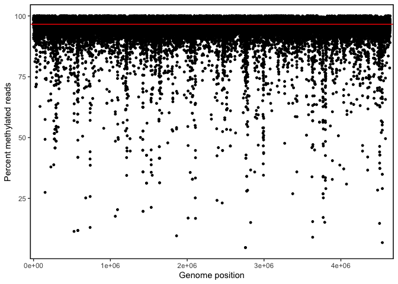<!-- -->

``` r
ggview(beta_x_position,
       width = 8,
       height = 4)

#ggsave(plot = beta_x_position,
#       filename = "/Users/carlstone/Library/CloudStorage/Box-Box/Behringer_Lab_Box_Drive/Projects/LongTermExpEvo/MethylationProject/Manuscript/Figures/figure_S1.png",
#       width = 8,
#       height = 4,
#       dpi = 320)
#
#ggsave(plot = beta_x_position,
#       filename = "/Users/carlstone/Library/CloudStorage/Box-Box/Behringer_Lab_Box_Drive/Projects/LongTermExpEvo/MethylationProject/Manuscript/Figures/figure_S1.pdf",
#       width = 8,
#       height = 4)
```

``` r
figure_s2 <- WT_average %>% 
  drop_na() %>% 
  ggplot(aes(x = cov, fill = Strand)) +
  geom_density(alpha = 0.75) +
  theme_stone() +
  scale_fill_brewer(palette = "Pastel1") +
  labs(x = "Read coverage",
       y = "Density") +
  geom_vline(xintercept = 57,
             linetype = "dashed") +
  scale_y_continuous(expand = expansion(mult = c(0.001, 0.05)))

ggview(figure_s2,
       width = 6,
       height = 4)

#ggsave(figure_s2,
#       filename = "/Users/carlstone/Library/CloudStorage/Box-Box/Behringer_Lab_Box_Drive/Projects/LongTermExpEvo/MethylationProject/Manuscript/Figures/figure_S2.png",
#       width = 6,
#       height = 4,
#       dpi = 320)
#
#ggsave(figure_s2,
#       filename = "/Users/carlstone/Library/CloudStorage/Box-Box/Behringer_Lab_Box_Drive/Projects/LongTermExpEvo/MethylationProject/Manuscript/Figures/figure_S2.pdf",
#       width = 6,
#       height = 4)
#
```

``` r
anc_kw <- WT_average_annotated_long %>% 
  kruskal_test(m ~ feature_type)
anc_dunn <- WT_average_annotated_long %>% 
  dunn_test(m ~ feature_type)
anc_wilcoxon_one_sample <- WT_average_annotated_long %>% 
  group_by(feature_type) %>% 
  wilcox_test(m ~ 1,
              mu = median(WT_average_annotated$m))
anc_wilcoxon_one_sample$p.adj <- p.adjust(anc_wilcoxon_one_sample$p,
                                          method = "BH")
anc_wilcoxon_feature_name <- WT_average_annotated_long %>% 
  filter(feature_type != "Genes" &
           feature_type != "Transcription Units" &
           feature_type != "mRNA Binding Sites" &
           feature_type != "No Feature") %>% 
    separate(feature_name, sep = ' ', c('feature_name', NA)) %>%
  group_by(feature_name) %>% 
  wilcox_test(m ~ 1,
              mu = median(WT_average_annotated$m))
```

    ## Warning: Expected 2 pieces. Additional pieces discarded in 359 rows [19, 20, 21, 22, 25,
    ## 26, 33, 34, 35, 36, 37, 38, 39, 40, 55, 56, 101, 102, 105, 435, ...].

    ## Warning: Expected 2 pieces. Missing pieces filled with `NA` in 2904 rows [1, 2, 3, 4, 5,
    ## 6, 7, 8, 9, 10, 11, 12, 13, 14, 15, 16, 17, 18, 23, 24, ...].

``` r
anc_wilcoxon_feature_name$p.adj <- p.adjust(anc_wilcoxon_feature_name$p,
                                            method = "BH")
anc_wilcoxon_feature_name$stars <- stars.pval(anc_wilcoxon_feature_name$p.adj)
anc_wilcoxon_feature_name[anc_wilcoxon_feature_name$p.adj < 0.05,]
```

<div data-pagedtable="false">

<script data-pagedtable-source type="application/json">
{"columns":[{"label":["feature_name"],"name":[1],"type":["chr"],"align":["left"]},{"label":[".y."],"name":[2],"type":["chr"],"align":["left"]},{"label":["group1"],"name":[3],"type":["chr"],"align":["left"]},{"label":["group2"],"name":[4],"type":["chr"],"align":["left"]},{"label":["n"],"name":[5],"type":["int"],"align":["right"]},{"label":["statistic"],"name":[6],"type":["dbl"],"align":["right"]},{"label":["p"],"name":[7],"type":["dbl"],"align":["right"]},{"label":["p.adj"],"name":[8],"type":["dbl"],"align":["right"]},{"label":["stars"],"name":[9],"type":["chr"],"align":["left"]}],"data":[{"1":"1","2":"m","3":"1","4":"null model","5":"1196","6":"72874","7":"8.63e-126","8":"2.330100e-123","9":"***"},{"1":"CP4-44","2":"m","3":"1","4":"null model","5":"58","6":"313","7":"2.71e-05","8":"6.097500e-04","9":"***"},{"1":"CP4-57","2":"m","3":"1","4":"null model","5":"140","6":"796","7":"7.41e-18","8":"6.669000e-16","9":"***"},{"1":"CP4-6","2":"m","3":"1","4":"null model","5":"266","6":"7841","7":"2.93e-15","8":"1.977750e-13","9":"***"},{"1":"CPS-53","2":"m","3":"1","4":"null model","5":"54","6":"132","7":"1.50e-07","8":"4.500000e-06","9":"***"},{"1":"CPZ-55","2":"m","3":"1","4":"null model","5":"48","6":"177","7":"8.29e-06","8":"2.034818e-04","9":"***"},{"1":"CRP-cAMP","2":"m","3":"1","4":"null model","5":"118","6":"56","7":"1.77e-20","8":"2.389500e-18","9":"***"},{"1":"DLP12","2":"m","3":"1","4":"null model","5":"88","6":"81","7":"5.82e-15","8":"3.142800e-13","9":"***"},{"1":"Fis","2":"m","3":"1","4":"null model","5":"17","6":"6","7":"2.14e-04","8":"4.127143e-03","9":"**"},{"1":"Fnr","2":"m","3":"1","4":"null model","5":"33","6":"29","7":"4.05e-07","8":"1.093500e-05","9":"***"},{"1":"IS150","2":"m","3":"1","4":"null model","5":"14","6":"0","7":"1.22e-04","8":"2.533846e-03","9":"**"},{"1":"IS30A","2":"m","3":"1","4":"null model","5":"12","6":"4","7":"3.42e-03","8":"4.617000e-02","9":"*"},{"1":"IS30C","2":"m","3":"1","4":"null model","5":"12","6":"1","7":"9.77e-04","8":"1.551706e-02","9":"*"},{"1":"IS30D","2":"m","3":"1","4":"null model","5":"12","6":"2","7":"1.46e-03","8":"2.190000e-02","9":"*"},{"1":"IS4","2":"m","3":"1","4":"null model","5":"16","6":"8","7":"7.63e-04","8":"1.287562e-02","9":"*"},{"1":"Nac","2":"m","3":"1","4":"null model","5":"23","6":"46","7":"3.87e-03","8":"4.975714e-02","9":"*"},{"1":"PR-Y","2":"m","3":"1","4":"null model","5":"10","6":"0","7":"1.95e-03","8":"2.771053e-02","9":"*"},{"1":"Qin","2":"m","3":"1","4":"null model","5":"104","6":"1074","7":"7.94e-08","8":"2.679750e-06","9":"***"},{"1":"Rac","2":"m","3":"1","4":"null model","5":"132","6":"1700","7":"1.02e-09","8":"3.934286e-08","9":"***"},{"1":"e14","2":"m","3":"1","4":"null model","5":"86","6":"396","7":"2.19e-10","8":"9.855000e-09","9":"***"},{"1":"oriC","2":"m","3":"1","4":"null model","5":"22","6":"22","7":"2.56e-04","8":"4.608000e-03","9":"**"}],"options":{"columns":{"min":{},"max":[10]},"rows":{"min":[10],"max":[10]},"pages":{}}}
  </script>

</div>

``` r
anc_medians <- WT_average_annotated_long %>% 
  group_by(feature_type) %>% 
  summarise(median_methyl = median(beta),
            median_m = median(m))
anc_medians_feature <- WT_average_annotated_long %>% 
  separate(feature_name, sep = ' ', c('feature_name', NA)) %>%
  group_by(feature_name) %>% 
  summarise(median_methyl = median(beta),
            median_m = median(m))
```

    ## Warning: Expected 2 pieces. Additional pieces discarded in 359 rows [153, 154, 263, 264,
    ## 360, 361, 670, 671, 733, 735, 737, 739, 792, 793, 1266, 1267, 2249, 2250, 2265,
    ## 3203, ...].

    ## Warning: Expected 2 pieces. Missing pieces filled with `NA` in 38839 rows [1, 2, 3, 4,
    ## 5, 6, 7, 8, 9, 10, 11, 12, 13, 14, 15, 16, 17, 18, 19, 20, ...].

``` r
anc_medians_feature[anc_medians_feature$feature_name %in% (genome_sites %>% filter(Type == "IS-Elements"))$Site,]
```

<div data-pagedtable="false">

<script data-pagedtable-source type="application/json">
{"columns":[{"label":["feature_name"],"name":[1],"type":["chr"],"align":["left"]},{"label":["median_methyl"],"name":[2],"type":["dbl"],"align":["right"]},{"label":["median_m"],"name":[3],"type":["dbl"],"align":["right"]}],"data":[{"1":"IS150","2":"0.8947333","3":"2.98996458"},{"1":"IS186A","2":"0.9843667","3":"5.62634851"},{"1":"IS186B","2":"0.9706333","3":"5.02607306"},{"1":"IS186C","2":"0.9629333","3":"4.59500242"},{"1":"IS2A","2":"0.9658833","3":"4.63219714"},{"1":"IS2D","2":"0.9433667","3":"4.02109435"},{"1":"IS2E","2":"0.9673833","3":"4.81535714"},{"1":"IS2F","2":"0.9461167","3":"4.10537586"},{"1":"IS2H","2":"0.9484500","3":"4.28911882"},{"1":"IS2I","2":"0.9586833","3":"4.34248122"},{"1":"IS2K","2":"0.9463500","3":"4.20164979"},{"1":"IS30A","2":"0.8968167","3":"3.03140918"},{"1":"IS30B","2":"0.4956667","3":"-0.01909542"},{"1":"IS30C","2":"0.8578167","3":"2.62274846"},{"1":"IS30D","2":"0.8674833","3":"2.70202228"},{"1":"IS3A","2":"0.8880667","3":"3.28282569"},{"1":"IS3B","2":"0.9008333","3":"3.08693667"},{"1":"IS3C","2":"0.9289667","3":"3.60155698"},{"1":"IS3D","2":"0.9304000","3":"3.67767003"},{"1":"IS3E","2":"0.9393667","3":"4.00786844"},{"1":"IS4","2":"0.9413500","3":"3.86611309"},{"1":"IS5A","2":"0.9366167","3":"3.88047663"},{"1":"IS5B","2":"0.8976833","3":"3.14494766"},{"1":"IS5D","2":"0.9329500","3":"4.08137354"},{"1":"IS5F","2":"0.9161833","3":"3.33425512"},{"1":"IS5H","2":"0.8924000","3":"2.96791528"},{"1":"IS5I","2":"0.9051833","3":"3.20058695"},{"1":"IS5K","2":"0.9178667","3":"3.51232338"},{"1":"IS5LO","2":"0.9293667","3":"3.67889489"},{"1":"IS5R","2":"0.9172333","3":"3.35174843"},{"1":"IS5T","2":"0.8949667","3":"3.01059406"},{"1":"IS5Y","2":"0.9503667","3":"4.10440052"},{"1":"IS600","2":"0.9473333","3":"3.99889872"},{"1":"IS609","2":"0.9540500","3":"4.57799915"},{"1":"IS911B-1","2":"0.9693000","3":"4.80495852"},{"1":"ISX","2":"0.9377000","3":"3.80234225"},{"1":"ISZ","2":"0.9261000","3":"3.51578755"}],"options":{"columns":{"min":{},"max":[10]},"rows":{"min":[10],"max":[10]},"pages":{}}}
  </script>

</div>

``` r
WT_average_annotated_long$feature_type <- 
  as.factor(WT_average_annotated_long$feature_type)
levels(WT_average_annotated_long$feature_type) <- list('Promoters' = 'Promoters',
                                                        '-10 Box' = 'BOX_10',
                                                        '-35 Box' = 'BOX_35',
                                                        'Sigma 24' = 'Sigma24',
                                                        'Sigma 28' = 'Sigma28',
                                                        'Sigma 32' = 'Sigma32',
                                                        'Sigma 38' = 'Sigma38',
                                                        'Sigma 70' = 'Sigma70',
                                                        'DNA Binding Sites' = 
                                                          'DNA-Binding-Sites',
                                                        'Transcription Units' = 
                                                          'Transcription-Units',
                                                        'Genes' = 'Genes',
                                                        'Rho-Dependent Terminators' = 
                                                          'Rho-Dependent-Terminators',
                                                        'Rho-Independent Terminators' = 
                                                          'Rho-Independent-Terminators',
                                                        'mRNA Binding Sites' = 
                                                          'mRNA-Binding-Sites',
                                                        'Origin of Replication' = 
                                                          'Origin-of-Replication',          
                                                        'Cryptic Prophages' = 
                                                          'Cryptic-Prophages',
                                                        'IS Elements' = 'IS-Elements',
                                                        'REP Elements' = 'REP-Elements',
                                                        'No Feature' = 'No_Feature'
                                                        )

# All features
fig_s7_feature_methylation_all <- WT_average_annotated_long %>% 
  filter(!grepl('Transcription|Sigma|mRNA', feature_type)) %>% 
  dplyr::mutate(feature_type = case_when(
  feature_type == "No Feature" ~ "Intergenic\nNo Other Feature",
  feature_type == "Rho-Dependent Terminators" ~ "Rho-Dependent\nTerminators",
  feature_type == "Rho-Independent Terminators" ~"Rho-Independent\nTerminators",
  feature_type == "Origin of Replication" ~ "Origin of\nReplication",
  feature_type == "DNA Binding Sites" ~ "DNA Binding\nSites",
  feature_type == "Cryptic Prophages" ~ "Cryptic\nProphges",
  .default = feature_type)) %>% 
  dplyr::mutate(feature_type = fct_relevel(feature_type,
                                           "Genes",
                                           "Promoters",
                                           "-10 Box",
                                           "-35 Box",
                                           "DNA Binding\nSites",
                                           "Cryptic\nProphges",
                                           "Rho-Dependent\nTerminators",
                                           "Rho-Independent\nTerminators",
                                           "Origin of\nReplication",
                                           "IS Elements",
                                           "REP Elements",
                                           "Intergenic\nNo Other Feature")) %>%
  ggplot(aes(x = feature_type, y = beta)) +
  geom_boxplot(notch = F,
               fill = 'gray85') +
  theme_classic() +
  labs(x = 'Feature type',
       y = 'Percent methylated reads')

#ggview(fig_s7_feature_methylation_all,
#       width = 13,
#       height = 4,
#       units = "in")
#
#ggsave(plot = fig_s7_feature_methylation_all,
#       filename = "figure_s7.png",
#       path = "/Users/carlstone/Library/CloudStorage/Box-Box/Behringer_Lab_Box_Drive/Projects/LongTermExpEvo/MethylationProject/Manuscript/Figures",
#       width = 13,
#       height = 4,
#       units = "in")
#ggsave(plot = fig_s7_feature_methylation_all,
#       filename = "figure_s7.pdf",
#       path = "/Users/carlstone/Library/CloudStorage/Box-Box/Behringer_Lab_Box_Drive/Projects/LongTermExpEvo/MethylationProject/Manuscript/Figures",
#       width = 13,
#       height = 4,
#       units = "in")

fig_s7 <- WT_average_annotated_long |> 
  dplyr::mutate(feature_type = case_when(
    feature_type == "No Feature" ~ "Intergenic\nNo Other Feature",
    feature_type == "Rho-Dependent Terminators" ~ "Rho-Dependent\nTerminators",
    feature_type == "Rho-Independent Terminators" ~ "Rho-Independent\nTerminators",
    .default = feature_type)) |> 
  filter(!grepl('Sigma', feature_type)) %>% 
  filter(feature_type != 'Sigma 32') %>% 
  ggplot(aes(x = feature_type,
             y = beta)) +
  geom_boxplot(fill = "gray85") +
  theme_classic()

# Just sigma factors
comparison_list <- rev(list(c('Sigma 24','Sigma 38'),
                            c('Sigma 24','Sigma 70'),
                            c('Sigma 28','Sigma 38'),
                            c('Sigma 28','Sigma 70')))
sigma_avg_methylation_plot <- WT_average_annotated_long %>% 
  filter(grepl('Sigma', feature_type)) %>% 
  filter(feature_type != 'Sigma 32') %>% 
  ggplot(aes(x = feature_type, y = beta*100)) +
  geom_boxplot(notch = FALSE,
               fill = 'gray85') +
  theme_classic() +
  labs(x = 'Sigma factor binding at -35 element',
       y = "Percent methylated reads") +
  geom_hline(yintercept = median(WT_average$beta*100),
             linetype = "dashed")
sigma_avg_methylation_plot
```

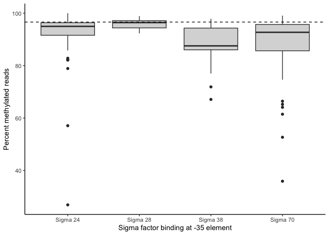<!-- -->

``` r
# Number of GATC sites in each Sigma factor binding site
WT_average_annotated_long %>% 
  filter(grepl('Sigma', feature_type)) %>% 
  group_by(feature_type) %>%
  summarise(n = n())
```

<div data-pagedtable="false">

<script data-pagedtable-source type="application/json">
{"columns":[{"label":["feature_type"],"name":[1],"type":["fct"],"align":["left"]},{"label":["n"],"name":[2],"type":["int"],"align":["right"]}],"data":[{"1":"Sigma 24","2":"69"},{"1":"Sigma 28","2":"10"},{"1":"Sigma 32","2":"2"},{"1":"Sigma 38","2":"17"},{"1":"Sigma 70","2":"84"}],"options":{"columns":{"min":{},"max":[10]},"rows":{"min":[10],"max":[10]},"pages":{}}}
  </script>

</div>

``` r
# Just IS elements
IS_avg_methylation_plot <- WT_average_annotated_long %>% 
  filter(feature_type == "IS Elements") %>% 
  ggplot(aes(x = feature_name, y = beta)) +
  geom_boxplot(notch = T,
               fill = 'gray85') +
  theme_classic() +
  labs(x = 'IS element',
       y = 'Percent methylated reads')
IS_avg_methylation_plot
```

    ## Notch went outside hinges
    ## ℹ Do you want `notch = FALSE`?
    ## Notch went outside hinges
    ## ℹ Do you want `notch = FALSE`?
    ## Notch went outside hinges
    ## ℹ Do you want `notch = FALSE`?
    ## Notch went outside hinges
    ## ℹ Do you want `notch = FALSE`?
    ## Notch went outside hinges
    ## ℹ Do you want `notch = FALSE`?
    ## Notch went outside hinges
    ## ℹ Do you want `notch = FALSE`?
    ## Notch went outside hinges
    ## ℹ Do you want `notch = FALSE`?
    ## Notch went outside hinges
    ## ℹ Do you want `notch = FALSE`?
    ## Notch went outside hinges
    ## ℹ Do you want `notch = FALSE`?
    ## Notch went outside hinges
    ## ℹ Do you want `notch = FALSE`?
    ## Notch went outside hinges
    ## ℹ Do you want `notch = FALSE`?
    ## Notch went outside hinges
    ## ℹ Do you want `notch = FALSE`?
    ## Notch went outside hinges
    ## ℹ Do you want `notch = FALSE`?
    ## Notch went outside hinges
    ## ℹ Do you want `notch = FALSE`?
    ## Notch went outside hinges
    ## ℹ Do you want `notch = FALSE`?
    ## Notch went outside hinges
    ## ℹ Do you want `notch = FALSE`?
    ## Notch went outside hinges
    ## ℹ Do you want `notch = FALSE`?
    ## Notch went outside hinges
    ## ℹ Do you want `notch = FALSE`?
    ## Notch went outside hinges
    ## ℹ Do you want `notch = FALSE`?
    ## Notch went outside hinges
    ## ℹ Do you want `notch = FALSE`?
    ## Notch went outside hinges
    ## ℹ Do you want `notch = FALSE`?
    ## Notch went outside hinges
    ## ℹ Do you want `notch = FALSE`?
    ## Notch went outside hinges
    ## ℹ Do you want `notch = FALSE`?
    ## Notch went outside hinges
    ## ℹ Do you want `notch = FALSE`?
    ## Notch went outside hinges
    ## ℹ Do you want `notch = FALSE`?
    ## Notch went outside hinges
    ## ℹ Do you want `notch = FALSE`?
    ## Notch went outside hinges
    ## ℹ Do you want `notch = FALSE`?
    ## Notch went outside hinges
    ## ℹ Do you want `notch = FALSE`?
    ## Notch went outside hinges
    ## ℹ Do you want `notch = FALSE`?
    ## Notch went outside hinges
    ## ℹ Do you want `notch = FALSE`?
    ## Notch went outside hinges
    ## ℹ Do you want `notch = FALSE`?
    ## Notch went outside hinges
    ## ℹ Do you want `notch = FALSE`?
    ## Notch went outside hinges
    ## ℹ Do you want `notch = FALSE`?
    ## Notch went outside hinges
    ## ℹ Do you want `notch = FALSE`?
    ## Notch went outside hinges
    ## ℹ Do you want `notch = FALSE`?

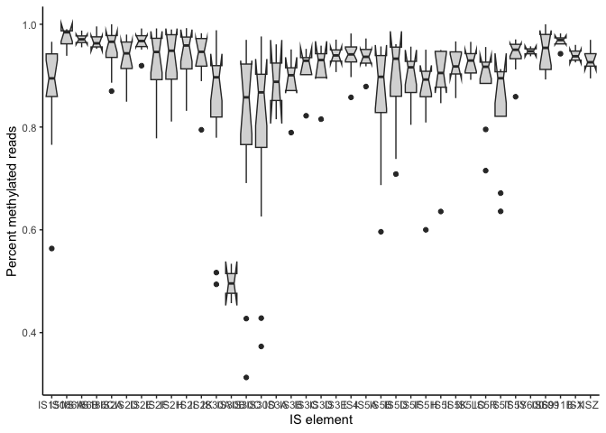<!-- -->

``` r
# Just cryptic prophages
prophage_avg_methylation_plot <- WT_average_annotated_long %>% 
  filter(feature_type == 'Cryptic Prophages') %>% 
  ggplot(aes(x = feature_name, y = beta)) +
  geom_boxplot(notch = T,
               fill = 'gray85') +
  theme_classic() +
  labs(x = 'Cryptic prophage',
       y = 'Percent methylated reads')
prophage_avg_methylation_plot
```

    ## Notch went outside hinges
    ## ℹ Do you want `notch = FALSE`?
    ## Notch went outside hinges
    ## ℹ Do you want `notch = FALSE`?

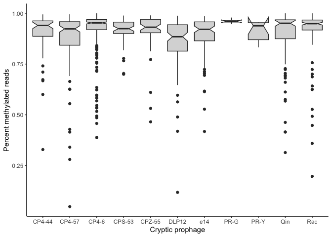<!-- -->

``` r
# Just DNA binding sites
DBS_avg_methylation_plot <- WT_average_annotated_long %>%
  filter(feature_type == 'DNA Binding Sites') %>% 
  separate(feature_name, sep = ' ', c('feature_name', NA)) %>% 
  ggplot(aes(x = feature_name, y = beta)) +
  geom_boxplot(notch = T,
               fill = 'gray85') +
  theme_classic() +
  labs(x = 'DNA Binding Factor',
       y = 'Percent methylated reads')
```

    ## Warning: Expected 2 pieces. Additional pieces discarded in 310 rows [1, 2, 3, 4, 5, 6,
    ## 7, 8, 9, 10, 11, 12, 13, 14, 15, 16, 17, 18, 19, 20, ...].

``` r
# Summary table of various DNA binding sites
all_DBS <- WT_average_annotated_long %>%
  filter(feature_type == 'DNA Binding Sites') %>% 
  separate(feature_name, sep = ' ', c('feature_name', NA)) %>% 
  group_by(feature_name) %>% 
  count(feature_name)
```

    ## Warning: Expected 2 pieces. Additional pieces discarded in 310 rows [1, 2, 3, 4, 5, 6,
    ## 7, 8, 9, 10, 11, 12, 13, 14, 15, 16, 17, 18, 19, 20, ...].

``` r
# Just DNA binding sites, excluding those with <3 GATC sites
DBS_threeplus_avg_methylation_plot <- WT_average_annotated_long %>%
  filter(feature_type == 'DNA Binding Sites') %>% 
  separate(feature_name, sep = ' ', c('feature_name', NA)) %>% 
  filter(feature_name %in% all_DBS[all_DBS$n > 2,]$feature_name) %>% 
  ggplot(aes(x = feature_name, y = beta)) +
  geom_boxplot(notch = F,
               fill = 'gray85') +
  theme_classic() +
  labs(x = 'DNA Binding Factor',
       y = 'Percent methylated reads')
```

    ## Warning: Expected 2 pieces. Additional pieces discarded in 310 rows [1, 2, 3, 4, 5, 6,
    ## 7, 8, 9, 10, 11, 12, 13, 14, 15, 16, 17, 18, 19, 20, ...].

``` r
DBS_threeplus_avg_methylation_plot
```

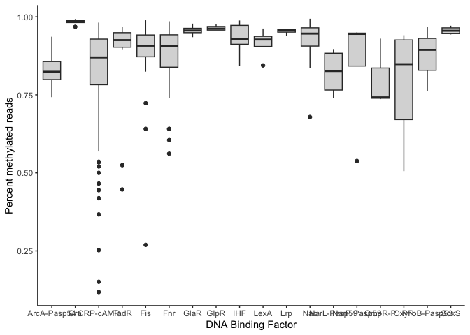<!-- -->

``` r
# REP elements
REP_avg_methylation_plot <- WT_average_annotated_long %>% 
  filter(feature_type == 'REP Elements') %>% 
  ggplot(aes(x = feature_name, y = beta)) +
  geom_boxplot(notch = F,
               fill = 'gray85') +
  theme_classic() +
  labs(x = 'REP Element',
       y = 'Percent methylated reads')
REP_avg_methylation_plot
```

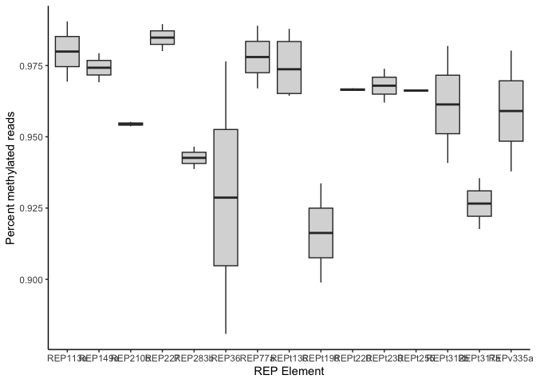<!-- -->

``` r
# Genic vs intergenic sites
genic_df <- WT_average_annotated %>% 
  filter(!is.na(Genes)) %>% 
  dplyr::select(Position, beta)
intergenic_df <- WT_average_annotated %>% 
  filter(is.na(Genes)) %>% 
  dplyr::select(Position, beta)
genic_df$gi <- "genic"
intergenic_df$gi <- "intergenic"
genic_intergenic_df <- bind_rows(genic_df, intergenic_df)
genic_plot <- ggplot(genic_intergenic_df,
                     aes(x = gi,
                         y = beta)) +
  geom_boxplot(notch = T, fill = 'gray85') +
  theme_classic() +
  labs(x = 'Genic/Intergenic',
       y = 'Percent methylated reads')
genic_plot
```

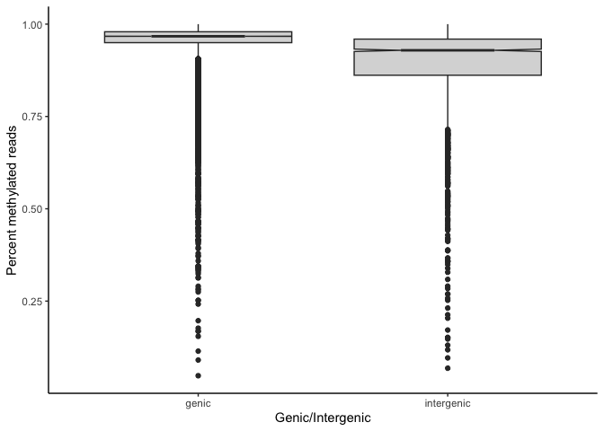<!-- -->

``` r
genic_intergenic_df$m <- methylBtoM(genic_intergenic_df$beta)
genic_intergenic_wilcox <- genic_intergenic_df %>% 
  wilcox_test(m ~ gi, exact = TRUE, detailed = TRUE)
```

``` r
# Panel A: TSS
WT_all_TSS <- annotateTSS(WT_average_annotated, 
                          genome_sites, 
                          location = 'Position', 
                          size = 500)
WT_all_TSS <- WT_all_TSS %>% pivot_longer(cols = starts_with('RelPos'),
                                          names_to = 'TSS_strand',
                                          names_pattern = 'RelPos_(.)[0-9]*',
                                          values_to = 'RelPos') %>% 
  distinct(Position, RelPos, .keep_all = TRUE) %>% 
  filter(!is.na(RelPos)) %>% 
  dplyr::select(c(Position:m,NoTSS:RelPos))

lambdavar <- 1000

TSS_plot <- ggplot(data = WT_all_TSS, aes(x = RelPos, y = beta*100)) +
  stat_summary(geom = 'point',
               fun = median) +
  geom_quantile(quantiles = 0.5,
                method = 'rqss',
                lambda = lambdavar,
                linewidth = 1) +
  geom_vline(xintercept = -35, linetype = 'dashed', color = 'red', linewidth = 1) +
  theme_classic() +
  labs(x = 'Position relative to TSS',
       y = "Percent methylated reads")
TSS_plot
```

    ## Smoothing formula not specified. Using: y ~ qss(x, lambda = 1000)

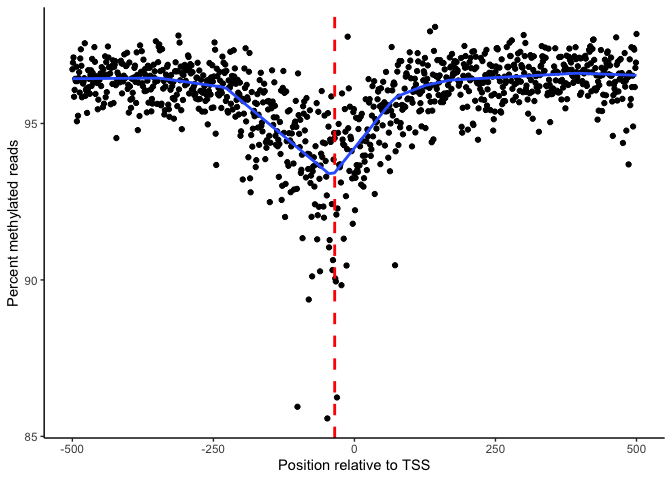<!-- -->

``` r
TSS_cov <- ggplot(data = WT_all_TSS, aes(x = RelPos, y = cov)) +
  stat_summary(geom = "point",
               fun = median) +
  geom_quantile(quantiles = 0.5,
                method = 'rqss',
                lambda = lambdavar,
                linewidth = 1)

# Use regression m ~ cov to predict TSS sites based on cov
# Shows that effect of coverage on m here is negligible
fit <- lm(m ~ cov, data = WT_average)
WT_all_TSS <- bind_cols(WT_all_TSS, predict(fit, WT_all_TSS, interval = 'confidence'))
WT_all_TSS |> 
  group_by(RelPos) |> 
  summarise(cov = mean(cov),
            beta = mean(beta),
            m = mean(m)) |> 
  ggplot(aes(x = RelPos, y = m, color = cov)) +
  geom_point() +
  scale_color_continuous(type = "viridis")
```

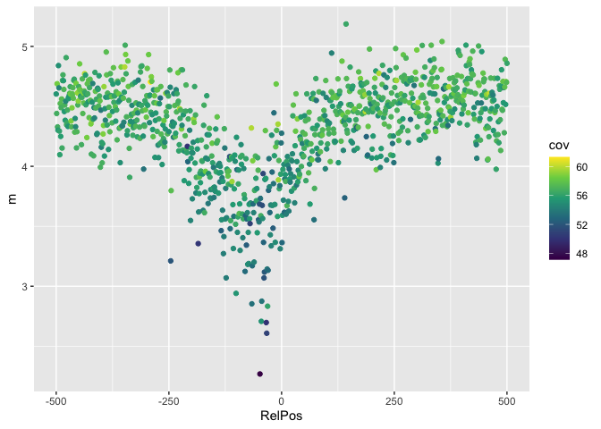<!-- -->

``` r
# Panel B: Sigma factors
# Use sigma_avg_methylation_plot from chunk above

# Panel C: Methylation in other genomic features
# Big figure with only the hits for main figure
# Set whether you want notches on all of the plots here
notch_bool <- FALSE
genome_median <- median(WT_average$beta*100)
genic_combined_plot <- ggplot(genic_intergenic_df,
                     aes(x = gi,
                         y = beta*100)) +
  geom_boxplot(notch = notch_bool,
               fill = '#FBB4AE') +
  theme_classic() +
  labs(x = 'Genic/Intergenic',
       y = "Percent methylated reads") +
  scale_y_continuous(breaks = seq(0, 100, 20),
                     limits = c(0,100)) +
  geom_hline(yintercept = genome_median,
             linetype = 'dashed') +
  theme(plot.margin = unit(c(0.1, 0, 0.1, 0.1), "cm"))
DBS_combined_plot <- WT_average_annotated_long %>%
  filter(feature_type == 'DNA Binding Sites') %>% 
  separate(feature_name, sep = ' ', c('feature_name', NA)) %>% 
  filter(feature_name == 'CRP-cAMP' |
           feature_name == 'Fnr' |
           feature_name == 'Nac' |
           feature_name == 'Fis' |
           feature_name == 'Cra' |
           feature_name == 'IHF' |
           feature_name == 'Lrp') %>% 
  dplyr::mutate(feature_name = forcats::fct_recode(feature_name, 'CRP' = 'CRP-cAMP')) %>% 
#  dplyr::mutate(feature_type = 
#                  forcats::fct_relevel(feature_type,
#                                       ))
  ggplot(aes(x = feature_name, y = beta*100)) +
  geom_boxplot(notch = notch_bool,
               fill = '#B3CDE3') +
  theme_classic() +
  labs(x = 'DNA Binding Factors') +
  scale_y_continuous(limits = c(0,100)) +
  theme(axis.line.y = element_blank(), 
        axis.text.y = element_blank(), 
        axis.ticks.y = element_blank(), 
        axis.title.y = element_blank(),
        plot.margin = unit(c(0.1, 0, 0.1, 0), "cm")) +
  geom_hline(yintercept = genome_median,
             linetype = 'dashed')
```

    ## Warning: Expected 2 pieces. Additional pieces discarded in 310 rows [1, 2, 3, 4, 5, 6,
    ## 7, 8, 9, 10, 11, 12, 13, 14, 15, 16, 17, 18, 19, 20, ...].

``` r
prophage_combined_plot <- WT_average_annotated_long %>% 
  filter(feature_name == 'DLP12' |
           feature_name == 'Rac' |
           feature_name == 'Qin' |
           feature_name == 'e14' |
           feature_name == 'CPZ-55') %>%
  ggplot(aes(x = feature_name, y = beta*100)) +
  geom_boxplot(notch = notch_bool,
               fill = '#CCEBC5') +
  theme_classic() +
  labs(x = 'Cryptic Prophages') +
  scale_y_continuous(limits = c(0,100)) +
  theme(axis.line.y = element_blank(), 
        axis.text.y = element_blank(), 
        axis.ticks.y = element_blank(), 
        axis.title.y = element_blank(),
        plot.margin = unit(c(0.1, 0, 0.1, 0), "cm")) +
  geom_hline(yintercept = genome_median,
             linetype = 'dashed')
IS_combined_plot <- WT_average_annotated_long %>% 
  filter(feature_name == 'IS2A' |
           feature_name == 'IS2D' |
           feature_name == 'IS5A' |
           feature_name == 'IS5B' |
           feature_name == 'IS150' |
           feature_name == 'IS186A' |
           feature_name == 'IS186B') %>% 
  ggplot(aes(x = feature_name, y = beta*100)) +
  geom_boxplot(notch = notch_bool,
               fill = '#DECBE4') +
  theme_classic() +
  labs(x = 'IS Elements') +
  scale_y_continuous(limits = c(0,100)) +
  theme(axis.line.y = element_blank(), 
        axis.text.y = element_blank(), 
        axis.ticks.y = element_blank(), 
        axis.title.y = element_blank(),
        plot.margin = unit(c(0.1, 0, 0.1, 0), "cm")) +
  geom_hline(yintercept = genome_median,
             linetype = 'dashed')

# Put it together
combined_plot <- plot_grid(genic_combined_plot, DBS_combined_plot, prophage_combined_plot,
                           IS_combined_plot,
                           nrow = 1,
                           rel_widths = c(5/9, 1, 5/7, 1),
                           labels = c("C", NULL, NULL, NULL, NULL))

bottom_plot <- plot_grid(NULL, combined_plot,
                         nrow = 2,
                         rel_heights = c(0.05, 1))

fig3_top <- plot_grid(TSS_plot, sigma_avg_methylation_plot,
                      nrow = 1,
                      labels = c("A", "B"))
```

    ## Smoothing formula not specified. Using: y ~ qss(x, lambda = 1000)

``` r
figure_3 <- plot_grid(fig3_top, bottom_plot,
                      nrow = 2,
                      align = "v",
                      axis = "r")
figure_3
```

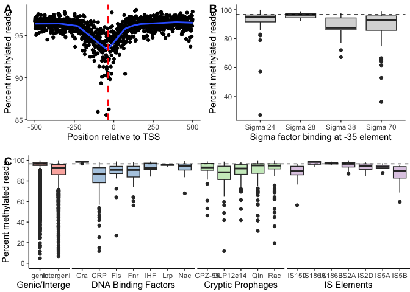<!-- -->

``` r
ggview(figure_3, width = 10, height = 7)


#ggsave(plot = figure_3,
#       filename = "figure_3.png",
#       path = "/Users/carlstone/Library/CloudStorage/Box-Box/Behringer_Lab_Box_Drive/Projects/LongTermExpEvo/MethylationProject/Manuscript/Figures",
#       width = 10,
#       height = 7,
#       dpi = 320)
#ggsave(plot = figure_3,
#       filename = "figure_3.pdf",
#       path = "/Users/carlstone/Library/CloudStorage/Box-Box/Behringer_Lab_Box_Drive/Projects/LongTermExpEvo/MethylationProject/Manuscript/Figures",
#       width = 10,
#       height = 7)

#ggsave(plot = figure_3,
#       filename = "figure_3.svg",
#       path = "/Users/carlstone/Library/CloudStorage/Box-Box/Behringer_Lab_Box_Drive/Projects/LongTermExpEvo/MethylationProject/Manuscript/Figures",
#       width = 10,
#       height = 7)
```

## Comparative analysis

### Summary differences between samples

``` r
summary_by_genotype <- mgAllSamplesLong %>% 
  group_by(genotype) %>% 
  summarize(med_beta = median(beta),
            med_m = median(m))
summary_by_sample <-  mgAllSamplesLong %>% 
  group_by(sample) %>% 
  summarize(med_beta = median(beta),
            med_m = median(m))

evolvedWT_average <- mgAllSamplesLong %>% 
  filter(sample %in% c("125.6", "125.7","129.1", "129.3")) %>% 
  group_by(Position) %>% 
  summarise(beta = mean(beta),
            m = mean(m))
evolvedMMR_average <- mgAllSamplesLong %>% 
  filter(sample %in% c("113.1", "113.2","126.2", "126.4")) %>% 
  group_by(Position) %>% 
  summarise(beta = mean(beta),
            m = mean(m))

all_averages <- WT_average %>% 
  left_join(evolvedWT_average, by = "Position", suffix = c("_anc", "_WT")) %>% 
  left_join(evolvedMMR_average, by = "Position") %>% 
  dplyr::rename(beta_MMR = beta, m_MMR = m) %>% 
  drop_na()

all_averages$WT_delta <- all_averages$beta_WT - all_averages$beta_anc
all_averages$MMR_delta <- all_averages$beta_MMR - all_averages$beta_anc

wilcox.test(all_averages$m_WT, all_averages$m_MMR)
```

    ## 
    ##  Wilcoxon rank sum test with continuity correction
    ## 
    ## data:  all_averages$m_WT and all_averages$m_MMR
    ## W = 642026272, p-value < 2.2e-16
    ## alternative hypothesis: true location shift is not equal to 0

``` r
evolved_medians <- mgAllSamplesLong %>% 
  group_by(genotype) %>% 
  summarise(median = median(m))

plot_data <- tibble(genotype = c(rep("WT", length(all_averages$Position)),
                                 rep("MMR-", length(all_averages$Position))),
                    beta = c(all_averages$WT_delta,
                             all_averages$MMR_delta))

figure_s4 <- plot_data %>% 
  ggplot(aes(x = beta*100, color = genotype, fill = genotype)) +
  stat_ecdf() +
  coord_cartesian(xlim = c(-15, 15)) +
  scale_color_manual("Genotype", values = c("#377EB8", "#E6E61A")) +
  theme_stone() +
  geom_vline(xintercept = 0) +
  labs(x = "Change in percent methylation",
       y = "Cumulative density")

ggview(figure_s4,
       width = 6,
       height = 4)

#ggsave(plot = figure_s4,
#       filename = "/Users/carlstone/Library/CloudStorage/Box-Box/Behringer_Lab_Box_Drive/Projects/LongTermExpEvo/MethylationProject/Manuscript/Figures/figure_s4.pdf",
#       width = 6,
#       height = 4)
  
#ggsave(plot = figure_s4,
#       filename = "/Users/carlstone/Library/CloudStorage/Box-Box/Behringer_Lab_Box_Drive/Projects/LongTermExpEvo/MethylationProject/Manuscript/Figures/figure_s4.png",
#       width = 6,
#       height = 4,
#       dpi = 320)

# Do KW test and Dunn's test
sample_distribution_plots <- mgAllSamplesLong %>% 
  ggplot(aes(x = beta,
             color = sample)) +
  stat_ecdf()
  

evolved_kw <- mgAllSamplesLong %>% 
  kruskal_test(m ~ genotype)
evolved_dunn <- mgAllSamplesLong %>% 
  dunn_test(m ~ genotype)
evolved_dunn_samples <- mgAllSamplesLong %>% 
  dunn_test(m ~ sample)

anc_kw <- WT_average_annotated_long %>% 
  kruskal_test(m ~ feature_type)
anc_dunn <- WT_average_annotated_long %>% 
  dunn_test(m ~ feature_type)
anc_wilcoxon_one_sample <- WT_average_annotated_long %>% 
  group_by(feature_type) %>% 
  wilcox_test(m ~ 1,
              mu = median(WT_average_annotated$m))
anc_wilcoxon_one_sample$p.adj <- p.adjust(anc_wilcoxon_one_sample$p,
                                          method = "BH")
anc_wilcoxon_one_sample$stars <- stars.pval(anc_wilcoxon_one_sample$p.adj)
anc_wilcoxon_feature_name <- WT_average_annotated_long %>% 
  filter(feature_type != "Genes" &
           feature_type != "Transcription Units" &
           feature_type != "mRNA Binding Sites" &
           feature_type != "No Feature") %>% 
  group_by(feature_name) %>% 
  wilcox_test(m ~ 1,
              mu = median(WT_average_annotated$m))
anc_wilcoxon_feature_name$p.adj <- p.adjust(anc_wilcoxon_feature_name$p,
                                            method = "BH")
anc_wilcoxon_feature_name$stars <- stars.pval(anc_wilcoxon_feature_name$p.adj)
#View(anc_wilcoxon_feature_name[anc_wilcoxon_feature_name$p.adj < 0.05,])
```

### Differential Methylation

Need to use getData and methylRaw methods to build methylRaw objects
from mgAllSamples_normalized

methylRaw object has slots sample.id = “WT1” assembly = “NC_000913.3”
context = “GATC” resolution = “base” names = “chr” “start” “end”
“strand” “coverage” “numCs” “numTs” row.names which are just 1:end .Data
which is a list \[\[1\]\] through \[\[7\]\] of the columns in names

``` r
# TODO Join mgAllSamples_normalized to original df with strand +/- and input that
# into the function

dm_data <- mgAllSamples[,2:24]
# Quantile normalize coverage values between samples
#dm_data[,2:12] <- dm_data %>% 
#  dplyr::select(starts_with("cov")) %>% 
#  as.matrix() %>% 
#  preprocessCore::normalize.quantiles(x = .)

dmObject_raw <- buildMethylRawList(as.data.frame(dm_data))
#dmObject@treatment = c(0,0,0,2,2,1,1,2,2,1,1)
dmObject_raw@treatment = c(0, 0, 0, 2, 2, 1, 1, 2, 2, 1, 1)
dmObject <- methylKit::normalizeCoverage(dmObject_raw, method = 'median')
```

``` r
allMethyl <- methylKit::unite(dmObject)
```

    ## uniting...

``` r
methylAvWT <- reorganize(allMethyl,
                           sample.ids = c('WT1', 'WT2', 'WT3', 
                                          '125.6', '125.7', '129.1', '129.3'),
                           treatment = c(0,0,0,1,1,1,1))
methylAvMMR <- reorganize(allMethyl,
                            sample.ids = c('WT1', 'WT2', 'WT3', 
                                           '113.1', '113.2', '126.2', '126.4'),
                            treatment = c(0,0,0,2,2,2,2))
suppressWarnings(
dmAvWT <- calculateDiffMeth(methylAvWT,
                            overdispersion = 'none',
                            effect = 'wmean')
)
```

    ## two groups detected:
    ##  will calculate methylation difference as the difference of
    ## treatment (group: 1) - control (group: 0)

``` r
suppressWarnings(
dmAvMMR <- calculateDiffMeth(methylAvMMR,
                             overdispersion = 'none',
                             effect = 'wmean')
)
```

    ## two groups detected:
    ##  will calculate methylation difference as the difference of
    ## treatment (group: 2) - control (group: 0)

``` r
# this method uses glm on the back end to do logistic regression, but
# unfortunately it gives a warning for every site because it is a 0-1 decimal
# and not an integer, so use suppressWarnings if you don't want 38000 warnings
#suppressWarnings(
#dmAll <- calculateDiffMeth(allMethyl,
#                           overdispersion = "none",
#                           effect = "wmean")
#)

# dm_tibble <- as_tibble(dmAll)

dmAvWT <- as_tibble(dmAvWT)
dmAvMMR <- as_tibble(dmAvMMR)

# Save for later so we don't have to do that again
#write_tsv(dm_tibble,
#          file = "/Users/carlstone/Library/CloudStorage/Box-Box/Behringer_Lab_Box_Drive/Projects/LongTermExpEvo/MethylationProject/Rscripts/diffMethSites.txt")

#write_tsv(dmAvWT,
#          file = "/Users/carlstone/Library/CloudStorage/Box-Box/Behringer_Lab_Box_Drive/Projects/LongTermExpEvo/MethylationProject/Rscripts/dmAvWT.txt")
#write_tsv(dmAvMMR,
#          file = "/Users/carlstone/Library/CloudStorage/Box-Box/Behringer_Lab_Box_Drive/Projects/LongTermExpEvo/MethylationProject/Rscripts/dmAvMMR.txt")
```

``` r
dmAvWT <- read_tsv(file = "/Users/carlstone/Library/CloudStorage/Box-Box/Behringer_Lab_Box_Drive/Projects/LongTermExpEvo/MethylationProject/Rscripts/dmAvWT.txt")
```

    ## Rows: 37759 Columns: 7
    ## ── Column specification ────────────────────────────────────────────────────────
    ## Delimiter: "\t"
    ## chr (2): chr, strand
    ## dbl (5): start, end, pvalue, qvalue, meth.diff
    ## 
    ## ℹ Use `spec()` to retrieve the full column specification for this data.
    ## ℹ Specify the column types or set `show_col_types = FALSE` to quiet this message.

``` r
dmAvMMR <- read_tsv(file = "/Users/carlstone/Library/CloudStorage/Box-Box/Behringer_Lab_Box_Drive/Projects/LongTermExpEvo/MethylationProject/Rscripts/dmAvMMR.txt")
```

    ## Rows: 37759 Columns: 7
    ## ── Column specification ────────────────────────────────────────────────────────
    ## Delimiter: "\t"
    ## chr (2): chr, strand
    ## dbl (5): start, end, pvalue, qvalue, meth.diff
    ## 
    ## ℹ Use `spec()` to retrieve the full column specification for this data.
    ## ℹ Specify the column types or set `show_col_types = FALSE` to quiet this message.

``` r
dmWT_metadata <- annotateMethylSites(dmAvWT,
                                     genome_sites,
                                     location = "start")
dmMMR_metadata <- annotateMethylSites(dmAvMMR,
                                     genome_sites,
                                     location = "start")

dmWT_metadata$mutated <- "NO"
dmMMR_metadata$mutated <- "NO"
mutatedGATCs <- rep(siteMutations$position, each = 7) + seq(-3,3)
dmWT_metadata <- dmWT_metadata %>% 
  filter(!(start %in% mutatedGATCs))
dmMMR_metadata <- dmMMR_metadata %>% 
  filter(!(start %in% mutatedGATCs))

percentCutoff <- 10
qvalueCutoff <- 0.05

# Classify as differentially methylated up or down for later coloring
dmWT_metadata$diffexpressed <- "No"
dmWT_metadata$diffexpressed[dmWT_metadata$meth.diff > percentCutoff &
                            dmWT_metadata$qvalue < qvalueCutoff] <- "Up"
dmWT_metadata$diffexpressed[dmWT_metadata$meth.diff < -percentCutoff &
                            dmWT_metadata$qvalue < qvalueCutoff] <- "Down"
dmMMR_metadata$diffexpressed <- "No"
dmMMR_metadata$diffexpressed[dmMMR_metadata$meth.diff > percentCutoff &
                             dmMMR_metadata$qvalue < qvalueCutoff] <- "Up"
dmMMR_metadata$diffexpressed[dmMMR_metadata$meth.diff < -percentCutoff &
                             dmMMR_metadata$qvalue < qvalueCutoff] <- "Down"

mycolors <- c("red", "blue", "gray")
names(mycolors) <- c("Up", "Down","No")

dmWT_plot <- dmWT_metadata %>% 
  ggplot(aes(x = meth.diff,
             y = -log10(qvalue),
             col = diffexpressed)) +
  geom_point() +
  scale_color_manual(values = mycolors) +
  geom_hline(yintercept = -log10(qvalueCutoff),
             col = "black",
             linetype = "dashed") +
  geom_vline(xintercept = c(-10, 10),
             col = "black",
             linetype = "dashed") +
  labs(x = "% methylation difference") +
  lims(x = c(-25, 25),
       y = c(NA, 25)) +
  theme_stone() +
  theme(panel.background = element_rect(color = "black",
                                        linewidth = 1),
        axis.line.x.bottom = element_line(linewidth = 0),
        axis.line.y.left = element_line(linewidth = 0)) +
  coord_fixed(ratio = 2) +
  annotate(
    'text',
    x = c(-19, 19),
    y = c(19, 19),
    label = c('16', '22'),
    size = c(7, 7),
    color = c('blue', 'red')
  )

dmMMR_plot <- dmMMR_metadata %>% 
  ggplot(aes(x = meth.diff,
             y = -log10(qvalue),
             col = diffexpressed)) +
  geom_point() +
  scale_color_manual(values = mycolors) +
  geom_hline(yintercept = -log10(qvalueCutoff),
             col = "black",
             linetype = "dashed") +
  geom_vline(xintercept = c(-10, 10),
             col = "black",
             linetype = "dashed") +
  labs(x = "% methylation difference") +
  lims(x = c(-25, 25),
       y = c(NA, 25)) +
  theme_stone() +
#  theme(panel.background = element_rect(color = "black",
#                                        linewidth = 1),
#        axis.line.x.bottom = element_line(linewidth = 0),
#        axis.line.y.left = element_line(linewidth = 0),
#        legend.position = "none") +
    theme(legend.position = "none") +
  coord_fixed(ratio = 2) +
  annotate(
    'text',
    x = c(-19, 19),
    y = c(19, 19),
    label = c('141', '28'),
    size = c(7, 7),
    color = c('blue', 'red')
  )

dm_legend <- cowplot::get_legend(dmWT_plot + theme(legend.box.margin = margin(0, 0,
                                                                              0, 12)))

dm_combined <- plot_grid(NULL, dmWT_plot + theme(legend.position = "none"), 
                         NULL, dmMMR_plot,
                         ncol = 1,
                         rel_heights = c(0.15, 1, -0.01, 1),
                         label_x = 0,
                         label_y = 1,
                         labels = c("","A","","B"))
dm_combined
```

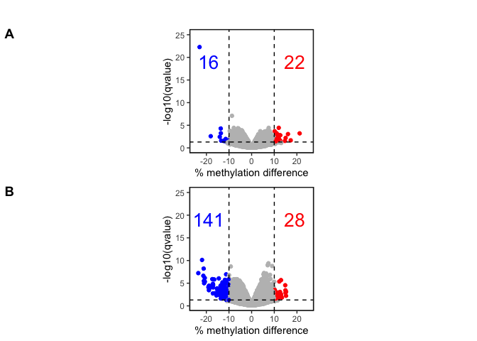<!-- -->

``` r
#ggview(dm_combined, width = 2.5, height = 4.5)
```

### Ordination

``` r
#mgAllSamples_normalized_list <- methylationNormalizeQuantiles(df = mgAllSamples,
#                                                              normalize_position = TRUE,
#                                                              plots = TRUE,
#                                                              shift_pos = FALSE,
#                                                              rescale = TRUE)
mgAllSamples_normalized_list <- methylationNormalize(df = mgAllSamples,
                                                     normalize_position = TRUE,
                                                     plots = FALSE,
                                                     rescale = TRUE)
mgAllSamples_normalized <- mgAllSamples_normalized_list$data

# Check how well samples were normalized
# plot_grid(plotlist = mgAllSamples_normalized_list$cov_plots)
# plot_grid(plotlist = mgAllSamples_normalized_list$methyl_plots)


mgAllSamples_normalized_long <- mgAllSamples_normalized %>% 
  pivot_longer(cols = !Position,
               names_to = c('.value', 'sample'),
               names_sep = '_')

mgAllSamples_normalized_long <- mgAllSamples_normalized_long %>% 
  dplyr::rename(beta = 'methyl')

mgAllSamples_normalized_long$m <- methylBtoM(mgAllSamples_normalized_long$beta,
                                             alpha = 1 / (max(mgAllSamples_normalized_long$cov) + 1))

mgAllSamples_normalized_long$genotype <- mgAllSamples_normalized_long$sample
mgAllSamples_normalized_long <- mgAllSamples_normalized_long %>% 
  mutate(genotype = recode(
    genotype,
    WT1 = 'anc',
    WT2 = 'anc',
    WT3 = 'anc',
    '125.6' = 'WT',
    '125.7' = 'WT',
    '129.1' = 'WT',
    '129.3' = 'WT',
    '113.1' = 'MMR',
    '113.2' = 'MMR',
    '126.2' = 'MMR',
    '126.4' = 'MMR'
  ))
```

``` r
# PCA with beta values and m values ---------------------------------------

pca_data <- mgAllSamples_normalized_long %>% 
  dplyr::select(!genotype) %>% 
  pivot_wider(names_from = sample,
              values_from = c(cov, beta, m),
              values_fill = NA) %>% 
  drop_na()

  

pca_m <- pca_data %>% 
  dplyr::select(starts_with('m')) %>% 
  t() %>% 
  prcomp(x = .)

pca_beta <- pca_data %>% 
  dplyr::select(starts_with('beta')) %>% 
  t() %>% 
  prcomp(x = .)

#autoplot(pca_beta, label = T)
#autoplot(pca_m, label = T)

# PCA too many dimensions so doing NMDS to flatten it


# NMDS
sites <- pca_data$Position
beta_distance <- pca_data %>% 
  dplyr::select(starts_with('beta')) %>% 
  t() %>% 
  vegdist(x = .,
          method = 'euclidean')
m_distance <- pca_data %>% 
  dplyr::select(starts_with('m')) %>% 
  t() %>% 
  vegdist(x = .,
          method = 'euclidean')
set.seed(1)
NMDS <- metaMDS(beta_distance,
                distance = 'euclidean',
                k = 3,
                trymax = 1000,
                maxit = 9999,
                noshare = F,
                zerodist = 'ignore',
                pc = T,
                center = T)
```

    ## Run 0 stress 0.08116223 
    ## Run 1 stress 0.07158693 
    ## ... New best solution
    ## ... Procrustes: rmse 0.1932009  max resid 0.3469884 
    ## Run 2 stress 0.07901629 
    ## Run 3 stress 0.07059002 
    ## ... New best solution
    ## ... Procrustes: rmse 0.09472765  max resid 0.2223083 
    ## Run 4 stress 0.07589873 
    ## Run 5 stress 0.06397079 
    ## ... New best solution
    ## ... Procrustes: rmse 0.1771999  max resid 0.2955943 
    ## Run 6 stress 0.07117809 
    ## Run 7 stress 0.0663261 
    ## Run 8 stress 0.06197575 
    ## ... New best solution
    ## ... Procrustes: rmse 0.05079273  max resid 0.1227035 
    ## Run 9 stress 0.06322117 
    ## Run 10 stress 0.06350101 
    ## Run 11 stress 0.06742788 
    ## Run 12 stress 0.06763776 
    ## Run 13 stress 0.07130426 
    ## Run 14 stress 0.06313451 
    ## Run 15 stress 0.07145166 
    ## Run 16 stress 0.06908691 
    ## Run 17 stress 0.07145167 
    ## Run 18 stress 0.07145169 
    ## Run 19 stress 0.0674279 
    ## Run 20 stress 0.07798558 
    ## Run 21 stress 0.06877857 
    ## Run 22 stress 0.07798558 
    ## Run 23 stress 0.064897 
    ## Run 24 stress 0.0776681 
    ## Run 25 stress 0.07193104 
    ## Run 26 stress 0.06783971 
    ## Run 27 stress 0.0694662 
    ## Run 28 stress 0.06488602 
    ## Run 29 stress 0.06908689 
    ## Run 30 stress 0.06557028 
    ## Run 31 stress 0.06333469 
    ## Run 32 stress 0.06394503 
    ## Run 33 stress 0.06657806 
    ## Run 34 stress 0.06652682 
    ## Run 35 stress 0.07130579 
    ## Run 36 stress 0.06318629 
    ## Run 37 stress 0.08165741 
    ## Run 38 stress 0.06652247 
    ## Run 39 stress 0.07786317 
    ## Run 40 stress 0.07269786 
    ## Run 41 stress 0.06639821 
    ## Run 42 stress 0.07292194 
    ## Run 43 stress 0.06435137 
    ## Run 44 stress 0.06322049 
    ## Run 45 stress 0.06435172 
    ## Run 46 stress 0.07394712 
    ## Run 47 stress 0.06920971 
    ## Run 48 stress 0.06512876 
    ## Run 49 stress 0.06197525 
    ## ... New best solution
    ## ... Procrustes: rmse 0.000200155  max resid 0.0004113593 
    ## ... Similar to previous best
    ## *** Best solution repeated 1 times

``` r
stressplot(NMDS)
```

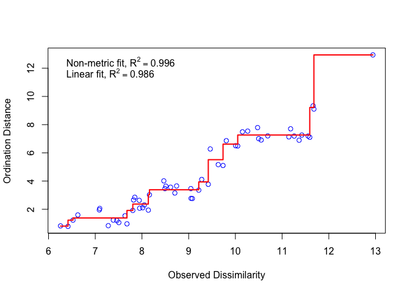<!-- -->

``` r
# stress_values <- numeric(4)
# for (i in 1:4) {
#   NMDS <- metaMDS(beta_distance,
#                 distance = 'euclidean',
#                 model = 'linear',
#                 k = i,
#                 try = 250,
#                 maxit = 999,
#                 wascores = T,
#                 autotransform = F,
#                 expand = F,
#                 noshare = F,
#                 zerodist = 'ignore',
#                 pc = T,
#                 center = T)
#   stress_values[i] <- NMDS$stress
# }
# plot(x = 1:4, y = stress_values)
groups_NMDS <- rep(NA, 11)
groups_NMDS[1:3] <- 'Ancestor'
groups_NMDS[c(4,5,8,9)] <- 'MMR-'
groups_NMDS[c(6,7,10,11)] <- 'WT'
samples_NMDS <- c("Anc1","Anc2","Anc3","113.1","113.2","125.6","125.7","126.2","126.4","129.1","129.3")
#ggplot it
NMDS_scores <- as.data.frame(NMDS[['points']])
NMDS_scores$Sample <- rownames(NMDS_scores)
NMDS_scores$Genotype <- groups_NMDS
#Point size 2 for NMDS.png
plot_NMDS <- ggplot(NMDS_scores,
                    aes(x = MDS1,
                        y = MDS2,
                        fill = Genotype,
                        shape = Genotype,
                        label = samples_NMDS)) +
  geom_point(size = 4) +
  #geom_text_repel() +
  theme_stone() +
  theme(legend.text = element_text(size = 12),
        legend.position = c(0.25, 0.75),
        legend.background = element_rect(fill = 'white', color = 'black'),
        legend.title = element_blank()) +
  labs(color = 'Group',
       x = "NMDS1",
       y = "NMDS2") +
  scale_fill_manual(values = c('black', "#377EB8", "#FFFF33")) +
  scale_shape_manual(values = c(21, 22, 24))
```

``` r
#beta_tree <- hclust(beta_distance)
#m_tree <- hclust(m_distance)
#plot(beta_tree)
#plot(m_tree)
#
#library(ape)
##write.tree(as.phylo(beta_tree),
#           file = "/Users/carlstone/Library/CloudStorage/Box-Box/Behringer_Lab_Box_Drive/Projects/LongTermExpEvo/MethylationProject/Trees/methyl_tree")
```

``` r
# permutational MANOVA using adonis2 from vegan
pca_metadata <- tibble(Genotype = groups_NMDS,
                       Population = c("Anc","Anc","Anc",
                                      "P113","P113","P125","P125",
                                      "P126","P126","P129","P129"))
permanova <- adonis2(beta_distance ~ Genotype,
                     data = pca_metadata,
                     method = "euclidean")
print(permanova)
```

    ## Permutation test for adonis under reduced model
    ## Terms added sequentially (first to last)
    ## Permutation: free
    ## Number of permutations: 999
    ## 
    ## adonis2(formula = beta_distance ~ Genotype, data = pca_metadata, method = "euclidean")
    ##          Df SumOfSqs      R2      F Pr(>F)  
    ## Genotype  2    93.73 0.21953 1.1251  0.031 *
    ## Residual  8   333.22 0.78047                
    ## Total    10   426.95 1.00000                
    ## ---
    ## Signif. codes:  0 '***' 0.001 '**' 0.01 '*' 0.05 '.' 0.1 ' ' 1

``` r
pairwise.adonis2(beta_distance ~ Genotype,
                 data = pca_metadata,
                 method = "euclidean")
```

    ## Set of permutations < 'minperm'. Generating entire set.
    ## Set of permutations < 'minperm'. Generating entire set.

    ## $parent_call
    ## [1] "beta_distance ~ Genotype , strata = Null , permutations 999"
    ## 
    ## $`Ancestor_vs_MMR-`
    ##          Df SumOfSqs      R2      F Pr(>F)
    ## Genotype  1   53.875 0.17498 1.0605  0.193
    ## Residual  5  254.012 0.82502              
    ## Total     6  307.888 1.00000              
    ## 
    ## $Ancestor_vs_WT
    ##          Df SumOfSqs      R2      F Pr(>F)
    ## Genotype  1   29.289 0.17274 1.0441  0.165
    ## Residual  5  140.262 0.82726              
    ## Total     6  169.551 1.00000              
    ## 
    ## $`MMR-_vs_WT`
    ##          Df SumOfSqs      R2      F Pr(>F)  
    ## Genotype  1    56.11 0.17092 1.2369  0.033 *
    ## Residual  6   272.17 0.82908                
    ## Total     7   328.28 1.00000                
    ## ---
    ## Signif. codes:  0 '***' 0.001 '**' 0.01 '*' 0.05 '.' 0.1 ' ' 1
    ## 
    ## attr(,"class")
    ## [1] "pwadstrata" "list"

``` r
beta_disper <- betadisper(beta_distance, group = groups_NMDS)
anova(beta_disper)
```

<div data-pagedtable="false">

<script data-pagedtable-source type="application/json">
{"columns":[{"label":[""],"name":["_rn_"],"type":[""],"align":["left"]},{"label":["Df"],"name":[1],"type":["int"],"align":["right"]},{"label":["Sum Sq"],"name":[2],"type":["dbl"],"align":["right"]},{"label":["Mean Sq"],"name":[3],"type":["dbl"],"align":["right"]},{"label":["F value"],"name":[4],"type":["dbl"],"align":["right"]},{"label":["Pr(>F)"],"name":[5],"type":["dbl"],"align":["right"]}],"data":[{"1":"2","2":"15.223757","3":"7.6118785","4":"9.799052","5":"0.007060621","_rn_":"Groups"},{"1":"8","2":"6.214379","3":"0.7767974","4":"NA","5":"NA","_rn_":"Residuals"}],"options":{"columns":{"min":{},"max":[10]},"rows":{"min":[10],"max":[10]},"pages":{}}}
  </script>

</div>

``` r
TukeyHSD(beta_disper)
```

    ##   Tukey multiple comparisons of means
    ##     95% family-wise confidence level
    ## 
    ## Fit: aov(formula = distances ~ group, data = df)
    ## 
    ## $group
    ##                      diff        lwr        upr     p adj
    ## MMR--Ancestor  2.39036486  0.4668743  4.3138554 0.0183084
    ## WT-Ancestor   -0.09444107 -2.0179316  1.8290495 0.9892218
    ## WT-MMR-       -2.48480593 -4.2656121 -0.7039997 0.0099694

``` r
permutest(beta_disper, pairwise = TRUE)
```

    ## 
    ## Permutation test for homogeneity of multivariate dispersions
    ## Permutation: free
    ## Number of permutations: 999
    ## 
    ## Response: Distances
    ##           Df  Sum Sq Mean Sq      F N.Perm Pr(>F)   
    ## Groups     2 15.2238  7.6119 9.7991    999  0.005 **
    ## Residuals  8  6.2144  0.7768                        
    ## ---
    ## Signif. codes:  0 '***' 0.001 '**' 0.01 '*' 0.05 '.' 0.1 ' ' 1
    ## 
    ## Pairwise comparisons:
    ## (Observed p-value below diagonal, permuted p-value above diagonal)
    ##          Ancestor     MMR-    WT
    ## Ancestor          0.011000 0.860
    ## MMR-     0.018923          0.005
    ## WT       0.861170 0.012501

``` r
# Combine dm_combined from above with plot_NMDS
cow_NMDS <- plot_grid(NULL, plot_NMDS,
                      ncol = 1,
                      rel_heights = c(0.075, 1),
                      labels = c("", "C"))
figure_4 <- plot_grid(dm_combined, NULL, cow_NMDS,
                      rel_widths = c(2, 0.1, 4),
                      nrow = 1,
                      align = "h",
                      axis = "bt")
ggview(figure_4, width = 6.5, height = 4.5)
#ggsave(filename = "/Users/carlstone/Library/CloudStorage/Box-Box/Behringer_Lab_Box_Drive/Projects/LongTermExpEvo/MethylationProject/Manuscript/Figures/figure_4.png",
#       plot = figure_4,
#       width = 6.5,
#       height = 4.5,
#       dpi = 320)
#ggsave(filename = "/Users/carlstone/Library/CloudStorage/Box-Box/Behringer_Lab_Box_Drive/Projects/LongTermExpEvo/MethylationProject/Manuscript/Figures/figure_4.pdf",
#       plot = figure_4,
#       width = 6.5,
#       height = 4.5)
```

``` r
list2df <- function(inputList) {
    # ldf <- lapply(1:length(inputList), function(i) {
    ldf <- lapply(seq_len(length(inputList)), function(i) {
        data.frame(categoryID=rep(names(inputList[i]),
                                  length(inputList[[i]])),
                   Gene=inputList[[i]])
    })

    do.call('rbind', ldf)
}

plot_upset <- function (x, n = 10, color = "grey", ...) {
    df <- as.data.frame(x)
    id <- df$ID[1:n]
    des <- df$Description[1:n]
    glist <- geneInCategory(x)[id]
    names(glist) <- des
    d <- list2df(glist)
    res <- tibble::tibble(Description = split(d[, 1], d[, 2]))
    ggplot(res, aes_(x = ~Description)) +
      geom_bar(color = color, fill = color) + 
      theme_classic() +
      #theme_dose(font.size = 12) + 
      xlab(NULL) + 
      ylab(NULL) + 
      ggupset::scale_x_upset(order_by = "freq") +
      theme(text = element_text(size = 12))
}
```

# GO analysis

``` r
all_dm_sites <- read_tsv("/Users/carlstone/Library/CloudStorage/Box-Box/Behringer_Lab_Box_Drive/Projects/LongTermExpEvo/MethylationProject/ComparativeAnalysis/DifferentialMethylation/all_dm_sites.txt")
```

    ## Rows: 207 Columns: 5
    ## ── Column specification ────────────────────────────────────────────────────────
    ## Delimiter: "\t"
    ## chr (2): location_types, genic_location
    ## dbl (3): position, qvalue, meth.diff
    ## 
    ## ℹ Use `spec()` to retrieve the full column specification for this data.
    ## ℹ Specify the column types or set `show_col_types = FALSE` to quiet this message.

``` r
WT_dm_sites <- read_tsv("/Users/carlstone/Library/CloudStorage/Box-Box/Behringer_Lab_Box_Drive/Projects/LongTermExpEvo/MethylationProject/ComparativeAnalysis/DifferentialMethylation/diffMethAncVsWT_metadata.txt")
```

    ## Rows: 37759 Columns: 12
    ## ── Column specification ────────────────────────────────────────────────────────
    ## Delimiter: "\t"
    ## chr (7): chr, strand, location_types, genic_location, mutated, diffexpressed...
    ## dbl (5): start, end, pvalue, qvalue, meth.diff
    ## 
    ## ℹ Use `spec()` to retrieve the full column specification for this data.
    ## ℹ Specify the column types or set `show_col_types = FALSE` to quiet this message.

``` r
MMR_dm_sites <- read_tsv("/Users/carlstone/Library/CloudStorage/Box-Box/Behringer_Lab_Box_Drive/Projects/LongTermExpEvo/MethylationProject/ComparativeAnalysis/DifferentialMethylation/diffMethAncVsMMR_metadata.txt")
```

    ## Rows: 37759 Columns: 12
    ## ── Column specification ────────────────────────────────────────────────────────
    ## Delimiter: "\t"
    ## chr (7): chr, strand, location_types, genic_location, mutated, diffexpressed...
    ## dbl (5): start, end, pvalue, qvalue, meth.diff
    ## 
    ## ℹ Use `spec()` to retrieve the full column specification for this data.
    ## ℹ Specify the column types or set `show_col_types = FALSE` to quiet this message.

``` r
#Process all_dm_sites for GO analysis
all_dm_sites <- all_dm_sites |> 
  tidyr::separate_wider_delim(cols = genic_location,
                              delim = "-",
                              names = c("gene1", "gene2"),
                              too_few = "align_start")
gene1 <- all_dm_sites$gene1
gene2 <- all_dm_sites$gene2
all_dm_sites <- all_dm_sites |> 
  bind_rows(all_dm_sites) |> 
  dplyr::select(!c(gene1, gene2))
all_dm_sites$gene <- c(gene1, gene2)
all_dm_sites <- all_dm_sites |> 
  drop_na()

write_tsv(all_dm_sites,
          file = "/Users/carlstone/Library/CloudStorage/Box-Box/Behringer_Lab_Box_Drive/Projects/LongTermExpEvo/MethylationProject/ComparativeAnalysis/DifferentialMethylation/all_dm_sites_clean.txt")

#Process WT and MMR separately for GSEA
WT_dm_sites$start <- WT_dm_sites$start + 1
MMR_dm_sites$start <- MMR_dm_sites$start + 1
WT_dm_sites <- WT_dm_sites |> 
  dplyr::filter(mutated == "NO") |> 
  dplyr::select(start, strand, qvalue, meth.diff, location_types, genic_location) |> 
  tidyr::separate_wider_delim(cols = genic_location,
                              delim = "-",
                              names = c("gene1", "gene2"),
                              too_few = "align_start")
WT_gene1 <- WT_dm_sites$gene1
WT_gene2 <- WT_dm_sites$gene2
WT_dm_sites <- WT_dm_sites |> 
  bind_rows(WT_dm_sites) |> 
  dplyr::select(!c(gene1, gene2))
WT_dm_sites$gene <- c(WT_gene1, WT_gene2)
WT_dm_sites <- WT_dm_sites |> 
  drop_na() |> 
  dplyr::mutate(gene = case_when(
    gene == "sfmZ" ~ "fimZ",
    gene == "flc" ~ "crcB",
    gene == "ybfK" ~ "speF",
    gene == "rhsO" ~ "ybfO",
    gene == "rspR" ~ "ydfH",
    gene == "insA" ~ "insA5",
    gene == "rhmA" ~ "yfaU",
    gene == "rhmT" ~ "yfaV",
    gene == "rhmR" ~ "yfaX",
    gene == "trmN" ~ "yfiC",
    .default = gene
  )) |> 
  rowwise() |> 
  dplyr::mutate(m = methylBtoM(meth.diff/100))
```

    ## Warning: There were 20032 warnings in `dplyr::mutate()`.
    ## The first warning was:
    ## ℹ In argument: `m = methylBtoM(meth.diff/100)`.
    ## ℹ In row 1.
    ## Caused by warning in `methylBtoM()`:
    ## ! NaNs produced
    ## ℹ Run `dplyr::last_dplyr_warnings()` to see the 20031 remaining warnings.

``` r
MMR_dm_sites <- MMR_dm_sites |> 
  dplyr::filter(mutated == "NO") |> 
  dplyr::select(start, strand, qvalue, meth.diff, location_types, genic_location) |> 
  tidyr::separate_wider_delim(cols = genic_location,
                              delim = "-",
                              names = c("gene1", "gene2"),
                              too_few = "align_start")
MMR_gene1 <- MMR_dm_sites$gene1
MMR_gene2 <- MMR_dm_sites$gene2
MMR_dm_sites <- MMR_dm_sites |> 
  bind_rows(MMR_dm_sites) |> 
  dplyr::select(!c(gene1, gene2))
MMR_dm_sites$gene <- c(MMR_gene1, MMR_gene2)
MMR_dm_sites <- MMR_dm_sites |> 
  drop_na() |> 
  dplyr::mutate(gene = case_when(
    gene == "sfmZ" ~ "fimZ",
    gene == "flc" ~ "crcB",
    gene == "ybfK" ~ "speF",
    gene == "rhsO" ~ "ybfO",
    gene == "rspR" ~ "ydfH",
    gene == "insA" ~ "insA5",
    gene == "rhmA" ~ "yfaU",
    gene == "rhmT" ~ "yfaV",
    gene == "rhmR" ~ "yfaX",
    gene == "trmN" ~ "yfiC",
    .default = gene
  )) |> 
  rowwise() |> 
  dplyr::mutate(m = methylBtoM(meth.diff/100))
```

    ## Warning: There were 20843 warnings in `dplyr::mutate()`.
    ## The first warning was:
    ## ℹ In argument: `m = methylBtoM(meth.diff/100)`.
    ## ℹ In row 1.
    ## Caused by warning in `methylBtoM()`:
    ## ! NaNs produced
    ## ℹ Run `dplyr::last_dplyr_warnings()` to see the 20842 remaining warnings.

``` r
# keytypes(org.EcK12.eg.db)

# Prepare gene ID's
## Start with all_dm_sites
entrez_genes <- bitr(all_dm_sites$gene, fromType = "ALIAS",
                     toType = "ENTREZID", OrgDb = "org.EcK12.eg.db")
```

    ## 'select()' returned 1:many mapping between keys and columns

``` r
alias_genes <- bitr(all_dm_sites$gene, fromType = "ALIAS",
                     toType = "SYMBOL", OrgDb = "org.EcK12.eg.db")
```

    ## 'select()' returned 1:many mapping between keys and columns

``` r
all_dm_sites <- all_dm_sites |> 
  left_join(entrez_genes, by = c("gene" = "ALIAS")) |> 
  left_join(alias_genes, by = c("gene" = "ALIAS"))
```

    ## Warning in left_join(all_dm_sites, entrez_genes, by = c(gene = "ALIAS")): Detected an unexpected many-to-many relationship between `x` and `y`.
    ## ℹ Row 25 of `x` matches multiple rows in `y`.
    ## ℹ Row 7 of `y` matches multiple rows in `x`.
    ## ℹ If a many-to-many relationship is expected, set `relationship =
    ##   "many-to-many"` to silence this warning.

    ## Warning in left_join(left_join(all_dm_sites, entrez_genes, by = c(gene = "ALIAS")), : Detected an unexpected many-to-many relationship between `x` and `y`.
    ## ℹ Row 25 of `x` matches multiple rows in `y`.
    ## ℹ Row 7 of `y` matches multiple rows in `x`.
    ## ℹ If a many-to-many relationship is expected, set `relationship =
    ##   "many-to-many"` to silence this warning.

``` r
up_geneNames <- all_dm_sites |> 
  dplyr::filter(meth.diff > 0) |> 
  dplyr::select(gene, SYMBOL) |> 
  unlist()
dn_geneNames <- all_dm_sites |> 
  dplyr::filter(meth.diff < 0) |> 
  dplyr::select(gene, SYMBOL) |> 
  unlist()

geneList <- all_dm_sites$meth.diff
names(geneList) <- as.character(all_dm_sites$ENTREZID)
geneList <- sort(geneList, decreasing = TRUE)

genes <- names(geneList)
#genes <- unique(genes)

geneList_up <- geneList[geneList > 0]
geneList_dn <- geneList[geneList < 0]

## Now do WT and MMR all sites separately for GSEA
entrez_WT <- bitr(WT_dm_sites$gene, fromType = "ALIAS",
                  toType = "ENTREZID", OrgDb = "org.EcK12.eg.db", drop = FALSE)
```

    ## 'select()' returned 1:many mapping between keys and columns

``` r
alias_WT <- bitr(WT_dm_sites$gene, fromType = "ALIAS",
                  toType = "SYMBOL", OrgDb = "org.EcK12.eg.db", drop = FALSE)
```

    ## 'select()' returned 1:many mapping between keys and columns

``` r
WT_dm_sites <- WT_dm_sites |> 
  left_join(entrez_WT, by = c("gene" = "ALIAS")) |> 
  left_join(alias_WT, by = c("gene" = "ALIAS"))
```

    ## Warning in left_join(WT_dm_sites, entrez_WT, by = c(gene = "ALIAS")): Detected an unexpected many-to-many relationship between `x` and `y`.
    ## ℹ Row 695 of `x` matches multiple rows in `y`.
    ## ℹ Row 1 of `y` matches multiple rows in `x`.
    ## ℹ If a many-to-many relationship is expected, set `relationship =
    ##   "many-to-many"` to silence this warning.

    ## Warning in left_join(left_join(WT_dm_sites, entrez_WT, by = c(gene = "ALIAS")), : Detected an unexpected many-to-many relationship between `x` and `y`.
    ## ℹ Row 695 of `x` matches multiple rows in `y`.
    ## ℹ Row 1 of `y` matches multiple rows in `x`.
    ## ℹ If a many-to-many relationship is expected, set `relationship =
    ##   "many-to-many"` to silence this warning.

``` r
WT_geneList_all <- WT_dm_sites$meth.diff
names(WT_geneList_all) <- as.character(WT_dm_sites$ENTREZID)
WT_geneList_all <- sort(WT_geneList_all, decreasing = TRUE)
WT_geneList <- WT_dm_sites |> 
  dplyr::filter(qvalue < 0.05,
                (meth.diff <= -10 | meth.diff >= 10)) |> 
  pull(meth.diff)
WT_geneNames <- WT_dm_sites |> 
  dplyr::filter(qvalue < 0.05,
                (meth.diff <= -10 | meth.diff >= 10)) |> 
  dplyr::select(gene, SYMBOL) |> 
  unlist()
names(WT_geneList) <- WT_dm_sites |> 
  dplyr::filter(qvalue < 0.05,
                (meth.diff <= -10 | meth.diff >= 10)) |> 
  pull(ENTREZID)
WT_geneList <- sort(WT_geneList, decreasing = TRUE)

entrez_MMR <- bitr(MMR_dm_sites$gene, fromType = "ALIAS",
                  toType = "ENTREZID", OrgDb = "org.EcK12.eg.db", drop = FALSE)
```

    ## 'select()' returned 1:many mapping between keys and columns

``` r
alias_MMR <- bitr(MMR_dm_sites$gene, fromType = "ALIAS",
                  toType = "SYMBOL", OrgDb = "org.EcK12.eg.db", drop = FALSE)
```

    ## 'select()' returned 1:many mapping between keys and columns

``` r
MMR_dm_sites <- MMR_dm_sites |> 
  left_join(entrez_MMR, by = c("gene" = "ALIAS")) |> 
  left_join(alias_MMR, by = c("gene" = "ALIAS"))
```

    ## Warning in left_join(MMR_dm_sites, entrez_MMR, by = c(gene = "ALIAS")): Detected an unexpected many-to-many relationship between `x` and `y`.
    ## ℹ Row 695 of `x` matches multiple rows in `y`.
    ## ℹ Row 1 of `y` matches multiple rows in `x`.
    ## ℹ If a many-to-many relationship is expected, set `relationship =
    ##   "many-to-many"` to silence this warning.

    ## Warning in left_join(left_join(MMR_dm_sites, entrez_MMR, by = c(gene = "ALIAS")), : Detected an unexpected many-to-many relationship between `x` and `y`.
    ## ℹ Row 695 of `x` matches multiple rows in `y`.
    ## ℹ Row 1 of `y` matches multiple rows in `x`.
    ## ℹ If a many-to-many relationship is expected, set `relationship =
    ##   "many-to-many"` to silence this warning.

``` r
MMR_geneList_all <- MMR_dm_sites$m
names(MMR_geneList_all) <- as.character(MMR_dm_sites$ENTREZID)
MMR_geneList_all <- sort(MMR_geneList_all, decreasing = TRUE)
MMR_geneList <- MMR_dm_sites |> 
  dplyr::filter(qvalue < 0.05,
                (meth.diff <= -10 | meth.diff >= 10)) |> 
  pull(meth.diff)
MMR_geneNames <- MMR_dm_sites |> 
  dplyr::filter(qvalue < 0.05,
                (meth.diff <= -10 | meth.diff >= 10)) |> 
  dplyr::select(gene, SYMBOL) |> 
  unlist()
names(MMR_geneList) <- MMR_dm_sites |> 
  dplyr::filter(qvalue < 0.05,
                (meth.diff <= -10 | meth.diff >= 10)) |> 
  pull(ENTREZID)
MMR_geneList <- sort(MMR_geneList, decreasing = TRUE)


# Classify GO
ggo <- groupGO(gene = genes,
               OrgDb = org.EcK12.eg.db,
               ont = "BP",
               level = 3,
               readable = TRUE)

# GO
ego <- enrichGO(gene = genes,
                OrgDb = org.EcK12.eg.db,
                ont = "BP",
                readable = TRUE)
#WT_go <- enrichGO(gene = names(WT_geneList),
#                  OrgDb = org.EcK12.eg.db,
#                  ont = "BP",
#                  readable = TRUE,
#                  pvalueCutoff = 0.05,
#                  qvalueCutoff = 0.2)
#MMR_go <- enrichGO(gene = names(MMR_geneList),
#                   OrgDb = org.EcK12.eg.db,
#                   ont = "BP",
#                   readable = TRUE,
#                   pvalueCutoff = 0.05,
#                   qvalueCutoff = 0.2)

# GO UP/DN
go_up <- enrichGO(gene = names(geneList_up),
                  OrgDb = org.EcK12.eg.db,
                  ont = "BP",
                  readable = TRUE,
                  pvalueCutoff = 0.05,
                  qvalueCutoff = 0.05)
go_dn <- enrichGO(gene = names(geneList_dn),
                  OrgDb = org.EcK12.eg.db,
                  ont = "BP",
                  readable = TRUE,
                  pvalueCutoff = 0.05,
                  qvalueCutoff = 0.05)

# SIMPLIFY SIMPLFY SIMPLIFY
ego <- clusterProfiler::simplify(ego, by = "pvalue")
go_up <- clusterProfiler::simplify(go_up, by = "pvalue")
go_dn <- clusterProfiler::simplify(go_dn, cutoff = 0.5, by = "pvalue")

# Combine lists
ego@result$group <- "All"
go_up@result$group <- "More Methylated"
go_dn@result$group <- "Less Methylated"
go_everything <- bind_rows(as.data.frame(ego),
                           as.data.frame(go_up),
                           as.data.frame(go_dn))

# Plot upset plots
n <- nrow(go_everything)
id <- go_everything$ID
des <- go_everything$Description
glist <- c(geneInCategory(ego)[ego$ID],
           geneInCategory(go_up)[go_up$ID],
           geneInCategory(go_dn)[go_dn$ID])
names(glist) <- des
d <- list2df(glist)
res <- tibble::tibble(Description = split(d[, 1], d[, 2]))
res <- tibble(Gene = names(res$Description), Ont = res$Description)
res$evogroup <- NA
res <- res |> dplyr::mutate(evogroup = case_when(
    (Gene %in% WT_geneNames & Gene %in% MMR_geneNames) ~ "Both",
    (Gene %in% WT_geneNames & !(Gene %in% MMR_geneNames)) ~ "WT",
    (Gene %in% MMR_geneNames & !(Gene %in% WT_geneNames)) ~ "MMR-")) |> 
  dplyr::mutate(upordown = case_when(
    Gene %in% up_geneNames ~ "Increased",
    Gene %in% dn_geneNames ~ "Decreased"))
res$evogroup <- factor(res$evogroup, levels = c("WT", "MMR-", "Both"))
res$upordown <- factor(res$upordown, levels = c("Increased", "Decreased"))
# Only one gene was in both up and down so I'm just copying it and manually
# changing so it is both up and down
res <- res |>  dplyr::filter(Gene == "waaJ") |> bind_rows(res)
res[1,4] <- "Decreased"
# Remove redundant ontologies in each gene
res$Ont <- map(res$Ont, \(x) unique(x))


upset_plot <- ggplot(res, aes(x = Ont,
                fill = evogroup)) +
  facet_grid(rows = vars(upordown)) +
  geom_bar(color = "black") +
  scale_y_continuous(expand = expansion(mult = c(0, 0.05))) +
  scale_x_upset(sets = c("cell adhesion",
                         "cell adhesion involved in biofilm formation",
                         "cell aggregation",
                         "biofilm formation",
                         "aggregation of unicellular organisms",
                         "negative regulation of metabolic process",
                         "mRNA catabolic process",
                         "response to acidic pH",
                         "response to nutrient levels",
                         "response to virus",
                         "lipopolysaccharide core region biosynthetic process",
                         "lipopolysaccharide core region metabolic process",
                         "liposaccharide metabolic process",
                         "polysaccharide metabolic process",
                         "oligosaccharide biosynthetic process",
                         "oligosaccharide metabolic process")) +
  scale_fill_manual(values = c("#FFFF33", "#377EB8", "#4DAF4A")) +
  theme_classic() +
  theme(text = element_text(size = 12),
        plot.margin = unit(c(0.5,0.5,0.5,7.1), "cm"),
        panel.border = element_rect(color = "black",
                                    linewidth = 1.5,
                                    fill = NA),
        axis.title.x = element_blank(),
        axis.text.y = element_text(color = "black"),
        legend.position = c(0.66,0.85),
        legend.direction = "horizontal",
        legend.title = element_text(size = 10,
                                    face = "bold"),
        legend.background = element_rect(color = "black")) +
  theme_combmatrix(combmatrix.label.make_space = FALSE,
                   combmatrix.label.text = element_text(color = "black",
                                                        face = "bold")) +
  labs(fill = "Evolved\nGenotype")

ggview(upset_plot,
       width = 8,
       height = 5.5,
       units = "in")
```

    ## Warning: Removed 11 rows containing non-finite values (`stat_count()`).

``` r
#ggsave(plot = upset_plot,
#       filename = "/Users/carlstone/Library/CloudStorage/Box-Box/Behringer_Lab_Box_Drive/Projects/LongTermExpEvo/MethylationProject/Manuscript/Figures/upsetplot_GO.pdf",
#       height = 5.5,
#       width = 8,
#       units = "in")
#ggsave(plot = upset_plot,
#       filename = "/Users/carlstone/Library/CloudStorage/Box-Box/Behringer_Lab_Box_Drive/Projects/LongTermExpEvo/MethylationProject/Manuscript/Figures/upsetplot_GO.png",
#       height = 5.5,
#       width = 8,
#       units = "in")

# Which genes are involved in certain processes?
#res[grepl("mRNA", res$Ont),]
#res[grepl("pH", res$Ont),]
res$Ont <- unname(res$Ont)
res |>
  group_by(Ont) |> 
  summarise(genes = toString(Gene)) |> 
  rowwise() |> 
  mutate(Ont = toString(Ont),
         count = length(str_split_1(genes, ","))) |> 
  arrange(desc(count)) |> 
  write_tsv(file = "/Users/carlstone/Library/CloudStorage/Box-Box/Behringer_Lab_Box_Drive/Projects/LongTermExpEvo/MethylationProject/Manuscript/GO_enriched_genes_table.txt")


upset_up <- upsetplot(go_up,  color = "blue")
upset_dn <- upsetplot(go_dn)
upset_all <- upsetplot(ego)
upset_updown <- plot_grid(upset_up, upset_dn,
                          ncol = 1)

#upsetplot(ego)
#
#ridgeplot(ego2, core_enrichment = FALSE)
#ridgeplot(ego)
```

# DM intersect euler plots

``` r
# Require library eulerr

# 38 dm sites in WT --> group A
# 169 dm sites in MMR- --> group B
# 13 within the same region --> A&B
# 10 of those within same GATC --> A&B&C
# 7 of those in same adenine --> A&B&C&D

dm_overlaps <- euler(c("A" = 25,
                       "B" = 156,
                       "A&B" = 13,
                       "A&B&C" = 10,
                       "A&B&C&D" = 7),
                     shape = "ellipse")
error_plot(dm_overlaps)
```

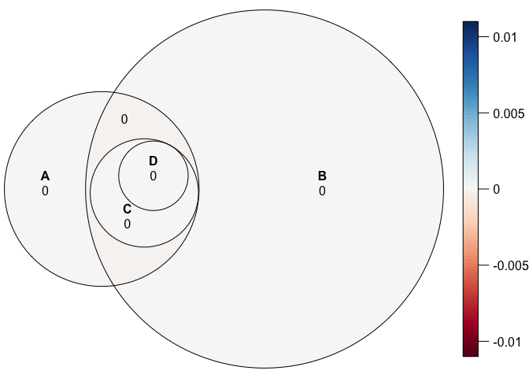<!-- -->

``` r
dm_euler <- plot(dm_overlaps,
                 quantities = TRUE,
                 labels = c("WT", "MMR-", "Same GATC", "Same Adenine"),
                 adjust_labels = TRUE)
```

    ## Warning in plot.euler(dm_overlaps, quantities = TRUE, labels = c("WT", "MMR-",
    ## : `adjust_labels` is deprecated and no longer has any effect.

``` r
# Make a bunch and pick the one that looks good
nplots <- 30
plot_list <- vector(mode = "list", length = nplots)
for (i in 1:nplots) {
  eulerobj <- euler(c("A" = 25,
                      "B" = 156,
                      "A&B" = 13,
                      "A&B&C" = 10,
                      "A&B&C&D" = 7),
                      shape = "ellipse")
  plot_list[[i]] <- as_ggplot(plot(eulerobj,
                                   quantities = TRUE, 
                                   labels = c("WT", "MMR-", "Same GATC", "Same Adenine"),
                                   fills = list(fill = c("#FFFF33", "#377EB8", "#278924", "#016300"),
                                   alpha = c(0.9, 0.9, 1, 1))))
}
# Look at them to see which one looks the best
plot_grid(plotlist = plot_list)
```

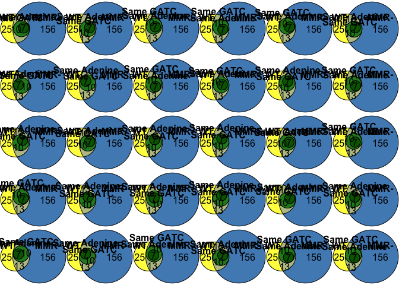<!-- -->

``` r
# Choose the one you like
dm_euler_plot <- plot_list[[26]]
#ggsave(dm_euler_plot,
#       filename = "/Users/carlstone/Library/CloudStorage/Box-Box/Behringer_Lab_Box_Drive/Projects/LongTermExpEvo/MethylationProject/Manuscript/Figures/venn_dm_sites.png")
#ggsave(dm_euler_plot,
#       filename = "/Users/carlstone/Library/CloudStorage/Box-Box/Behringer_Lab_Box_Drive/Projects/LongTermExpEvo/MethylationProject/Manuscript/Figures/venn_dm_sites.pdf")
dm_euler_plot <- plot(dm_overlaps,
                      fills = list(fill = c("#FFFF33", "#377EB8", "#278924", "#016300"),
                                   alpha = c(0.9, 0.9, 1, 1)))
# Recolor the intersect to be this color "#4DAF4A"

# Now import plot after some photoshopping
dm_euler_image <- cowplot::ggdraw() +
  cowplot::draw_image("/Users/carlstone/Library/CloudStorage/Box-Box/Behringer_Lab_Box_Drive/Projects/LongTermExpEvo/MethylationProject/Manuscript/Figures/venn_dm_sites_final.svg")
```

    ## Warning: Package `magick` is required to draw images. Image not drawn.

``` r
figure_4 <- ggdraw(upset_plot) +
  draw_image("/Users/carlstone/Library/CloudStorage/Box-Box/Behringer_Lab_Box_Drive/Projects/LongTermExpEvo/MethylationProject/Manuscript/Figures/venn_dm_sites_final.svg",
             width = 0.45,
             height = 0.45,
             x = -0.06,
             y = 0.555) +
  draw_label("A",
             x = 0.015,
             y = 0.95,
             fontface = "bold") +
  draw_label("B",
             x = 0.35,
             y = 0.95,
             fontface = "bold")
```

    ## Warning: Removed 11 rows containing non-finite values (`stat_count()`).

    ## Warning: Package `magick` is required to draw images. Image not drawn.

``` r
ggview(figure_4,
       height = 5.5,
       width = 8, units = "in")

#ggsave(plot = figure_4,
#       filename = "/Users/carlstone/Library/CloudStorage/Box-Box/Behringer_Lab_Box_Drive/Projects/LongTermExpEvo/MethylationProject/Manuscript/Figures/new_figure_4.png",
#       height = 5.5,
#       width = 8,
#       units = "in")
#ggsave(plot = figure_4,
#       filename = "/Users/carlstone/Library/CloudStorage/Box-Box/Behringer_Lab_Box_Drive/Projects/LongTermExpEvo/MethylationProject/Manuscript/Figures/new_figure_4.pdf",
#       height = 5.5,
#       width = 8,
#       units = "in")
```

``` r
sessionInfo()
```

    ## R version 4.3.0 Patched (2023-05-23 r84465)
    ## Platform: aarch64-apple-darwin20 (64-bit)
    ## Running under: macOS Monterey 12.6.3
    ## 
    ## Matrix products: default
    ## BLAS:   /Library/Frameworks/R.framework/Versions/4.3-arm64/Resources/lib/libRblas.0.dylib 
    ## LAPACK: /Library/Frameworks/R.framework/Versions/4.3-arm64/Resources/lib/libRlapack.dylib;  LAPACK version 3.11.0
    ## 
    ## locale:
    ## [1] en_US.UTF-8/en_US.UTF-8/en_US.UTF-8/C/en_US.UTF-8/en_US.UTF-8
    ## 
    ## time zone: America/Chicago
    ## tzcode source: internal
    ## 
    ## attached base packages:
    ## [1] splines   stats4    stats     graphics  grDevices utils     datasets 
    ## [8] methods   base     
    ## 
    ## other attached packages:
    ##  [1] ggview_0.1.0           org.EcK12.eg.db_3.17.0 AnnotationDbi_1.62.2  
    ##  [4] Biobase_2.60.0         clusterProfiler_4.8.1  DOSE_3.26.1           
    ##  [7] enrichplot_1.20.0      pairwiseAdonis_0.4.1   cluster_2.1.4         
    ## [10] ggupset_0.3.0          readxl_1.4.2           gtools_3.9.4          
    ## [13] remotes_2.4.2          quantreg_5.95          SparseM_1.81          
    ## [16] Metrics_0.1.4          ragg_1.2.5             eulerr_7.0.0          
    ## [19] circlize_0.4.15        ggpubr_0.6.0           MASS_7.3-60           
    ## [22] modelr_0.1.11          rstatix_0.7.2          preprocessCore_1.62.1 
    ## [25] boot_1.3-28.1          R.utils_2.12.2         R.oo_1.25.0           
    ## [28] R.methodsS3_1.8.2      RColorBrewer_1.1-3     moments_0.14.1        
    ## [31] ggfortify_0.4.16       vegan_2.6-4            lattice_0.21-8        
    ## [34] permute_0.9-7          ggrepel_0.9.3          cowplot_1.1.1         
    ## [37] methylKit_1.26.0       GenomicRanges_1.52.0   GenomeInfoDb_1.36.0   
    ## [40] IRanges_2.34.0         S4Vectors_0.38.1       BiocGenerics_0.46.0   
    ## [43] lubridate_1.9.2        forcats_1.0.0          stringr_1.5.0         
    ## [46] dplyr_1.1.2            purrr_1.0.1            readr_2.1.4           
    ## [49] tidyr_1.3.0            tibble_3.2.1           ggplot2_3.4.2         
    ## [52] tidyverse_2.0.0       
    ## 
    ## loaded via a namespace (and not attached):
    ##   [1] BiocIO_1.10.0               ggplotify_0.1.1            
    ##   [3] bitops_1.0-7                cellranger_1.1.0           
    ##   [5] polyclip_1.10-4             XML_3.99-0.14              
    ##   [7] lifecycle_1.0.3             vroom_1.6.3                
    ##   [9] backports_1.4.1             magrittr_2.0.3             
    ##  [11] limma_3.56.2                rmarkdown_2.23             
    ##  [13] yaml_2.3.7                  DBI_1.1.3                  
    ##  [15] abind_1.4-5                 zlibbioc_1.46.0            
    ##  [17] ggraph_2.1.0                RCurl_1.98-1.12            
    ##  [19] yulab.utils_0.0.6           tweenr_2.0.2               
    ##  [21] GenomeInfoDbData_1.2.10     tidytree_0.4.2             
    ##  [23] MatrixModels_0.5-1          codetools_0.2-19           
    ##  [25] DelayedArray_0.26.3         ggforce_0.4.1              
    ##  [27] tidyselect_1.2.0            shape_1.4.6                
    ##  [29] aplot_0.1.10                farver_2.1.1               
    ##  [31] viridis_0.6.3               matrixStats_1.0.0          
    ##  [33] jsonlite_1.8.7              GenomicAlignments_1.36.0   
    ##  [35] tidygraph_1.2.3             survival_3.5-5             
    ##  [37] systemfonts_1.0.4           polylabelr_0.2.0           
    ##  [39] bbmle_1.0.25                tools_4.3.0                
    ##  [41] treeio_1.24.1               Rcpp_1.0.10                
    ##  [43] glue_1.6.2                  gridExtra_2.3              
    ##  [45] xfun_0.39                   mgcv_1.8-42                
    ##  [47] qvalue_2.32.0               MatrixGenerics_1.12.0      
    ##  [49] withr_2.5.0                 numDeriv_2016.8-1.1        
    ##  [51] fastmap_1.1.1               fansi_1.0.4                
    ##  [53] digest_0.6.31               gridGraphics_0.5-1         
    ##  [55] timechange_0.2.0            R6_2.5.1                   
    ##  [57] textshaping_0.3.6           colorspace_2.1-0           
    ##  [59] GO.db_3.17.0                RSQLite_2.3.1              
    ##  [61] utf8_1.2.3                  generics_0.1.3             
    ##  [63] data.table_1.14.8           rtracklayer_1.60.0         
    ##  [65] graphlayouts_1.0.0          httr_1.4.6                 
    ##  [67] S4Arrays_1.0.4              scatterpie_0.2.1           
    ##  [69] pkgconfig_2.0.3             gtable_0.3.3               
    ##  [71] blob_1.2.4                  XVector_0.40.0             
    ##  [73] shadowtext_0.1.2            htmltools_0.5.5            
    ##  [75] carData_3.0-5               fgsea_1.26.0               
    ##  [77] scales_1.2.1                png_0.1-8                  
    ##  [79] ggfun_0.1.1                 knitr_1.43                 
    ##  [81] rstudioapi_0.14             tzdb_0.4.0                 
    ##  [83] reshape2_1.4.4              rjson_0.2.21               
    ##  [85] coda_0.19-4                 nlme_3.1-162               
    ##  [87] bdsmatrix_1.3-6             cachem_1.0.8               
    ##  [89] GlobalOptions_0.1.2         HDO.db_0.99.1              
    ##  [91] parallel_4.3.0              restfulr_0.0.15            
    ##  [93] pillar_1.9.0                grid_4.3.0                 
    ##  [95] vctrs_0.6.3                 car_3.1-2                  
    ##  [97] evaluate_0.21               mvtnorm_1.2-2              
    ##  [99] cli_3.6.1                   compiler_4.3.0             
    ## [101] Rsamtools_2.16.0            rlang_1.1.1                
    ## [103] crayon_1.5.2                ggsignif_0.6.4             
    ## [105] labeling_0.4.2              mclust_6.0.0               
    ## [107] emdbook_1.3.13              plyr_1.8.8                 
    ## [109] stringi_1.7.12              viridisLite_0.4.2          
    ## [111] BiocParallel_1.34.2         munsell_0.5.0              
    ## [113] Biostrings_2.68.1           lazyeval_0.2.2             
    ## [115] GOSemSim_2.26.0             Matrix_1.5-4.1             
    ## [117] patchwork_1.1.2             hms_1.1.3                  
    ## [119] bit64_4.0.5                 KEGGREST_1.40.0            
    ## [121] highr_0.10                  SummarizedExperiment_1.30.2
    ## [123] fastseg_1.46.0              igraph_1.5.0               
    ## [125] broom_1.0.5                 memoise_2.0.1              
    ## [127] ggtree_3.8.0                fastmatch_1.1-3            
    ## [129] bit_4.0.5                   downloader_0.4             
    ## [131] gson_0.1.0                  ape_5.7-1
